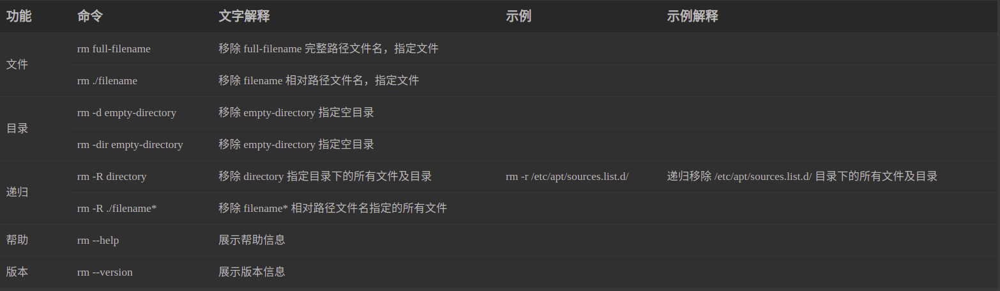

## 分区

    1.挂载点"/" 主分区 空间起始位置 文件系统类型 ext4日志文件系统 容量102400M (100G)

    2.挂载点-无 逻辑分区 空间起始位置 文件系统类型 交换文件系统(swap) 容量32768M(32G)

    3.挂载点"/boot" 逻辑分区 空间起始位置 文件系统类型 ext4日志文件系统 容量4096M (4G),启动器安装到/boot 分区下

    4.挂载点-无 逻辑分区 空间起始位置 文件系统类型 efi 文件系统 容量4096M(4G)

    5.挂载点"/home" 逻辑分区 空间起始位置 文件系统类型 ext4日志文件系统 容量 剩余全部

## ubuntu20隐藏桌面图表

    gsettings set org.gnome.shell.extensions.desktop-icons show-home false
    gsettings set org.gnome.shell.extensions.desktop-icons show-trash false

## rm

### 基本语法
    
    rm [OPTION]... FILE...

### Options 选项(部分)

|  参数   | 解释  |
|  ----  | ----  |
| -f, --force  | 忽略不存在的文件和自变量，从不提示 |
| -i  | 每次移除前提示 |
| -I  | 在移除 3 个以上文件之前或递归移除时提示一次；比 -i 更少侵扰，仍可防止大多数失误 |
| -r, -R, --recursive  | 递归移除目录及其内容 |
| -d, --dir  | 移除空目录 |

### 基础用法

## tar

### 基本语法
    
    tar [OPTION]... FILENAME... [OPTION]... FILENAME...

### Options 选项(部分)

    一般而言，以“.gz”结尾的是以gzip方式进行压缩的，以".bz2"结尾的是以bzip2方式压缩的。

|  参数   | 解释  |
|  ----  | ----  |
| c | 表示创建,用来生成文件包 |
| x | 表示提取,从文件包中提取文件 |
| z | 使用 gzip 方式进行处理,它与“c”结合就表示压缩,与“x”结合就表示解压缩 |
| j | 使用 bzip2 方式进行处理,它与“c”结合就表示压缩,与“x”结合就表示解压缩 |
| v | 即view，是可视化的意思，想看解压的文件进度就加上v。 |
| f | 表示文件,后面接着一个文件名 |

### 指定解压

    tar xzf demo.tar.gz -C /home/demo