# 1.安装

## 1.1.前言

这阵子因为以后工作的原因，所以开始了go语言的学习之旅，工欲善其事必先利其器，首先就得把go语言环境搭建完成

## 1.2.下载Go

因为go语言的官网经常打不开，所以我就找了一个 [镜像网站](https://studygolang.com/dl)，里面有很多版本的Go语言，选择自己合适的，比如我的是Windows电脑，所以我选中里面的Windows版本的

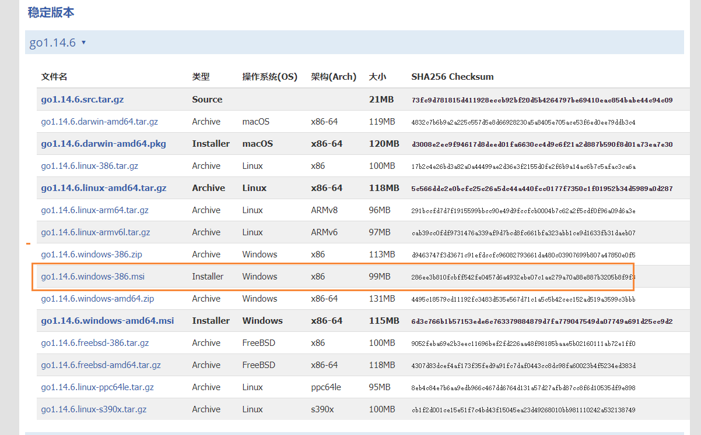

下载完成是一个安装文件，我们需要进行安装，同时需要注意的就是安装目录，因为事后还需要配置环境变量，下面是安装成功后的图片


## 1.3.配置环境变量

根据windows系统在查找可执行程序的原理，可以将Go所在路径定义到环境变量中，让系统帮我们去找运行的执行程序，这样在任何目录下都可以执行go指令，需要配置的环境变量有：

| 环境变量 | 说明              |
| -------- | ----------------- |
| GOROOT   | 指定SDK的安装目录 |
| Path     | 添加SDK的/binmulu |
| GOPATH   | 工作目录          |

首先我们需要打开我们的环境变量，然后添加上GOROOT

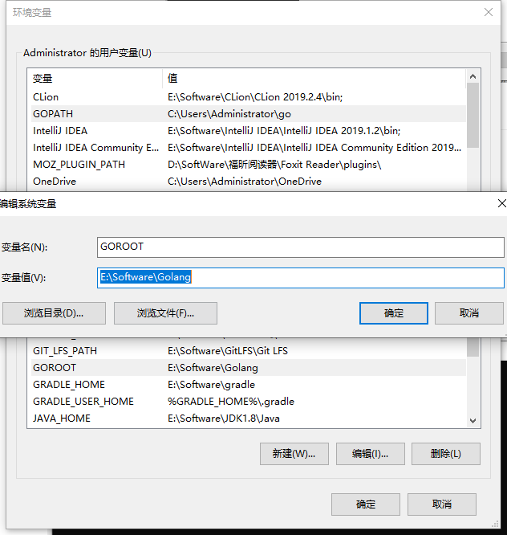

然后我们在PATH上添加我们的bin目录

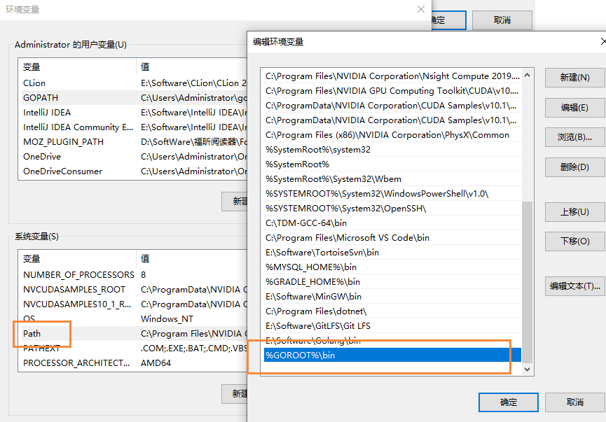

添加完成后，我们输入下面的命令，查看是否配置成功

```bash
go version
```

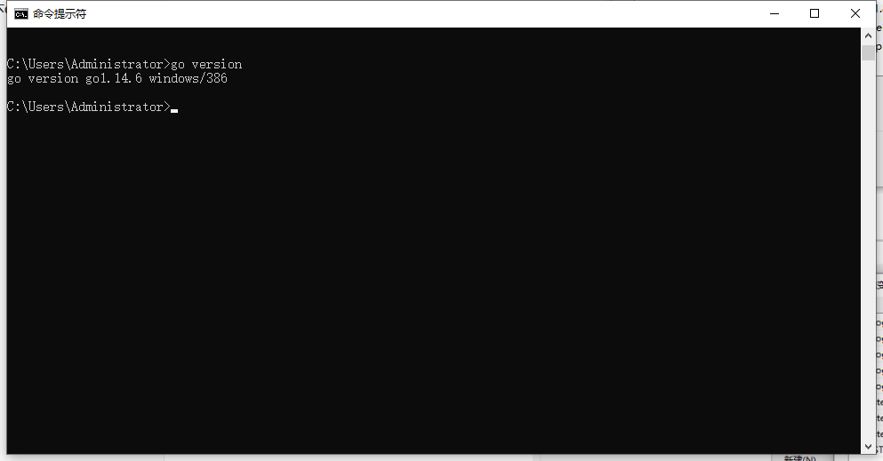


## 1.4.hello world!

在上面的方法都完成以后，我来来输出hello world吧~

```go
package main

import "fmt"

func main() {
	fmt.Println("hello world!")
}
```

代码的说明

- go文件的后缀是.go
- package main：表示该hello.go文件所在的包是main，在go中，每个文件都归属与一个包
- import "fmt"：表示引入一个包，可以调用里面的函数
- func main()：表示程序入口，是一个主函数

输出结果

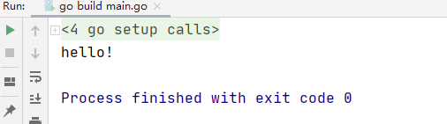

## 1.5.编译和执行

我们可以通过使用下面命令进行编译和执行

```bash
# 编译 hello.go 后 会生成一个 hello.exe文件
go build hello.go
# 运行 hello.ext
hello.ext
```

需要注意的是，我们也可以使用下面的方式，来直接运行的（使用go run会比较慢，因为内部有个编译的过程）

```bash
go run hello.go
```

但是在生产环境中，是需要先编译在执行的


# 2.发展简史

## 2.1.开发文档

https://studygolang.com/pkgdoc

## 2.2.Go语言核心开发团队

Ken Thompson（肯·汤普森）：1983年图灵奖（Turing Award）和1998年美国国家技术奖（National Medal of Technology）得主。他与Dennis Ritchie是Unix的原创者。Thompson也发明了后来衍生出C语言的B程序语言，同时也是C语言的主要发明人。

Rob Pike（罗布-派克）：曾是贝尔实验室（Bell Labs）的Unix团队，和Plan 9操作系统计划的成员。
他与Thompson共事多年，并共创出广泛使用的UTF-8字元编码。

Robert Griesemer：曾协助制作Java的HotSpot编译器，和Chrome浏览器的JavaScript引擎V8。


## 2.3.Google为什么要创建Go

- 计算机硬件技术更新频繁，性能提高很快。目前主流的编程语言发展明显落后于硬件，不能合理利用多核多CPU的优势提升软件系统性能。
- 软件系统复杂度越来越高，维护成本越来越高，目前缺乏一个足够简洁高效的编程语言。
  - 现有编程语言存在：风格不统一、计算能力不够、处理大并发不够好
- 企业运行维护很多c/c++的项目，c/c++程序运行速度虽然很快，但是编译速度确很慢，同时还存在内存泄漏的一系列的困扰需要解决。

## 2.4.Go语言发展历史

- 2007年，谷歌工程师Rob Pike，Ken Thompson和Robert Griesemer开始设计一门全新的语言，这是Go语言的最初原型。
- 2009年11月10日，Google将Go语言以开放源代码的方式向全球发布。
- 2015年8月19日，Go1.5版发布，本次更新中移除了”最后残余的c代码”
- 2017年2月17日，Go语言Go1.8版发布。
- 2017年8月24日，Go语言Go1.9版发布。
- 2018年2月16日，Go语言Go1.10版发布。

## 2.5.Go语言的特点

Go语言保证了既能到达静态编译语言的安全和性能，又达到了动态语言开发维护的高效率，使用一个表达式来形容Go语言：Go=C+Python，说明Go语言既有C静态语言程序的运行速度，又能达到Python动态语言的快速开发。

- 从c语言中继承了很多理念，包括表达式语法，控制结构，基础数据类型，调用参数传值，指针等等，也保留了和C语言一样的编译执行方式及弱化的指针。

```go
// go语言的指针使用特点
func testPtr(num *int)  {
	*num = 20
}
```

- 引入包的概念，用于组织程序结构，Go语言的一个文件都要归属于一个包，而不能单独存在。
- 垃圾回收机制，内存自动回收，不需开发人员管理 【稍微不注意就会出现内存泄漏】
- 天然并发【重要特点】
  - 从语言层面支持并发，实现简单
  - goroutine，轻量级线程，可实现大并发处理，高效利用多核。
  - 基于CPS并发模型（Communicating Sequential Processes）实现
- 吸收了管道通信机制，形成go语言特有的管道channel，通过管道channel，可以实现不同的goroute之间的相互通信
- 函数返回多个值（实例代码）
- 新的创新：比如切片slice，延时执行defer等

## 2.6.Golang执行流程分析

我们可以通过以下命令来进行操作

- go build hello.go    -> hello.exe
- go  run  hello.go

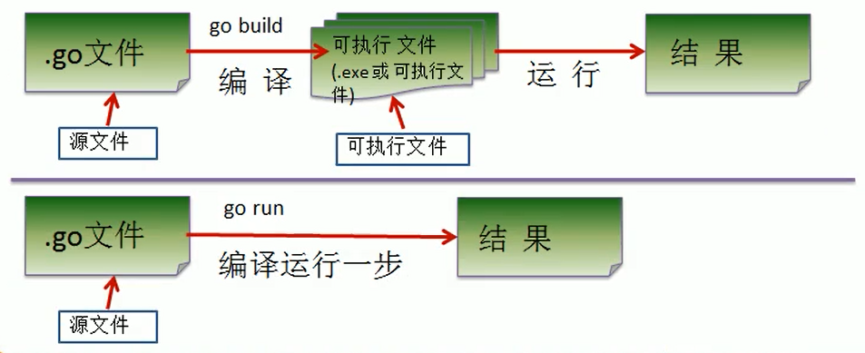

### 2.6.1.两种执行流程分析

- 如果我们先编译生成了可执行文件，那么我们可以将该可执行文件拷贝到没有go开发环境的机器上，然可以运行
- 如果我们是直接go run go源代码，那么如果要在另外一个机器上运行，也需要go开发环境，否则无法执行。
- 在编译时，编译器会将程序运行依赖的库文件包含在可执行文件中，所以，可执行文件变大了很多。

### 2.6.2.什么是编译

- 有了go源文件，通过编译器将其编译成机器可以识别的二进制码文件。
- 在该源文件目录下，通过go build 对hello.go文件进行编译。可以指定生成的可执行文件名，在windows下必须是.exe后缀。
- 如果程序没有错误，没有任何提示，会在当前目录下会出现一个可执行文件（windows下是.exe Linux下是一个可执行文件），该文件是二进制码文件，也是可以执行的程序。
- 如果程序有错误，编译时，会在错误的那行报错。

## 2.7.Go语言开发注意事项

- Go源文件以“go”为扩展名
- Go应用程序的执行入口是main()方法
- Go语言严格区分大小写。
- Go方法由一条条语句构成，每个语句后不需要分号（Go语言会在每行后自动加分号），这也体现出Golang的简洁性。
- Go编译器是一行行进行编译的，因此我们一行就写一条语句，不能把多条语句写在同一个，否则报错
- Go语言定义的变量或者import的包如果没有使用到，代码不能编译通过
- 大括号都是成对出现的，缺一不可。

## 2.8.Go语言中的转义字符

GoLang常用的转义字符（escape char）

- \t：一个制表位，实现对齐的功能
- \n：换行符
- \\：一个\
- \r：一个回车


# 3.变量和常量

## 3.1.变量的声明

Go语言变量是由字母、数字、下划线组成，其中首个字符不能为数字。Go语言中关键字和保留字都不能用作变量名

Go语言中变量需要声明后才能使用，同一作用域内不支持重复声明。并且Go语言的变量声明后必须使用。

变量声明后，没有初始化，打印出来的是空

## 3.2.如何定义变量

### 3.2.1.方式1：

```go
var name = "zhangsan"
```

### 3.2.2.方式2：带类型

```go
var name string = "zhangsan"
```

### 3.2.3.方式3：类型推导方式定义变量

```go
//在函数内部，可以使用更简略的 := 方式声明并初始化变量
//注意：短变量只能用于声明局部变量，不能用于全局变量声明
变量名 := 表达式
```

### 3.2.4.方式4：声明多个变量

```go
// 类型都是一样的变量
var 变量名称， 变量名称 类型
```


```go
// 类型不一样的变量
var (
	变量名称 类型
    变量名称 类型
)
```

案例

```go
var a1, a2 string
a1 = "123"
a2 = "123"
fmt.Printf(a1)
fmt.Printf(a2)
```

### 3.2.5.总结

全部的定义方式

```go
package main
import "fmt"

func main() {
	fmt.Println("hello")
	fmt.Print("A", "B", "C")
	fmt.Println()
	var a = 10
	fmt.Printf( "%d", a )

	var name = "zhangsan1"
	var name2 string = "zhangsan2"
	name3 := "zhangsan3"

	fmt.Println(name)
	fmt.Println(name2)
	fmt.Println(name3)
	fmt.Printf("name1=%v name2=%v name3=%v \n", name, name2, name3)
}
```

## 3.3.如何定义常量

相对于变量，常量是恒定不变的值，多用于定义程序运行期间不会改变的那些值。常量的声明和变量声明非常类似，只是把var换成了const，常量在定义的时候必须赋值。

```go
// 定义了常量，可以不用立即使用
const pi = 3.14

// 定义两个常量
const(
    A = "A"
    B = "B"
)

// const同时声明多个常量时，如果省略了值表示和上面一行的值相同
const(
    A = "A"
    B
    C
)
```

## 3.4.Const常量结合iota的使用

iota是golang 语言的常量计数器，只能在常量的表达式中使用

iota在const关键字出现时将被重置为0（const内部的第一行之前），const中每新增一行常量声明将使iota计数一次（iota可理解为const语句块中的行索引）。

每次const出现，都会让iota初始化为0【自增长】

```go
const a = iota // a = 0
const (
	b = iota // b=0
    c        // c = 1
    d        // d = 2
)
```

const  iota使用_跳过某些值

```go
const (
	b = iota // b=0
    _
    d        // d = 2
)
```

# 4.数据类型

## 4.1.概述

Go 语言中数据类型分为：基本数据类型和复合数据类型基本数据类型有：

整型、浮点型、布尔型、字符串

复合数据类型有：

数组、切片、结构体、函数、map、通道（channel）、接口等。

## 4.2.整型

整型的类型有很多中，包括 int8，int16，int32，int64。我们可以根据具体的情况来进行定义

如果我们直接写 int也是可以的，它在不同的操作系统中，int的大小是不一样的

- 32位操作系统：int  -> int32
- 64位操作系统：int -> int64

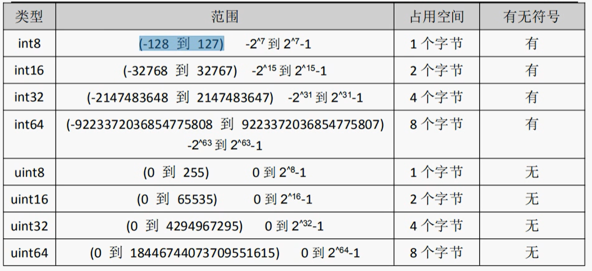

> 可以通过unsafe.Sizeof 查看不同长度的整型，在内存里面的存储空间
>
> ```
> var num2 = 12
> fmt.Println(unsafe.Sizeof(num2))
> ```

### 4.2.1.类型转换

通过在变量前面添加指定类型，就可以进行强制类型转换

```go
var a1 int16 = 10
var a2 int32 = 12
var a3 = int32(a1) + a2
fmt.Println(a3)
```

注意，高位转低位的时候，需要注意，会存在精度丢失，比如上述16转8位的时候，就丢失了

```go
var n1 int16 = 130
fmt.Println(int8(n1)) // 变成 -126
```

### 4.2.2.数字字面量语法

Go1.13版本之后，引入了数字字面量语法，这样便于开发者以二进制、八进制或十六进制浮点数的格式定义数字，例如：

```go
v := 0b00101101  // 代表二进制的101101
v：= Oo377       // 代表八进制的377
```

### 4.2.3.进制转换

```go
var number = 17
// 原样输出
fmt.Printf("%v\n", number)
// 十进制输出
fmt.Printf("%d\n", number)
// 以八进制输出
fmt.Printf("%o\n", number)
// 以二进制输出
fmt.Printf("%b\n", number)
// 以十六进制输出
fmt.Printf("%x\n", number)
```

## 4.3.浮点型

Go语言支持两种浮点型数：float32和float64。这两种浮点型数据格式遵循IEEE754标准：

float32的浮点数的最大范围约为3.4e38，可以使用常量定义：math.MaxFloat32。float64的浮点数的最大范围约为1.8e308，可以使用一个常量定义：math.MaxFloat64

打印浮点数时，可以使用fmt包配合动词%f，代码如下：

```go
var pi = math.Pi
// 打印浮点类型，默认小数点6位
fmt.Printf("%f\n", pi)
// 打印浮点类型，打印小数点后2位
fmt.Printf("%.2f\n", pi)
```

### 4.3.1.精度丢失的问题

几乎所有的编程语言都有精度丢失的问题，这是典型的二进制浮点数精度损失问题，在定长条件下，二进制小数和十进制小数互转可能有精度丢失

```go
d := 1129.6
fmt.Println(d*100) //输出112959.99999999
```

解决方法，使用第三方包来解决精度损失的问题

http://github.com/shopspring/decimal

## 4.4.布尔类型

定义

```go
var fl = false
if f1 {
    fmt.Println("true")
} else {
    fmt.Println("false")
}
```

## 4.5.字符串类型

Go 语言中的字符串以原生数据类型出现，使用字符串就像使用其他原生数据类型（int、bool、float32、float64等）一样。Go语言里的字符串的内部实现使用UTF-8编码。字符串的值为双引号（"）中的内容，可以在Go语言的源码中直接添加非ASCll码字符，例如：

```go
s1 := "hello"
s1 := "你好"
```

如果想要定义多行字符串，可以使用反引号

```go
	var str = `第一行
第二行`
	fmt.Println(str)
```

### 4.5.1.字符串常见操作

- len(str)：求长度
- +或fmt.Sprintf：拼接字符串
- strings.Split：分割
- strings.contains：判断是否包含
- strings.HasPrefix，strings.HasSuffix：前缀/后缀判断
- strings.Index()，strings.LastIndex()：子串出现的位置
- strings.Join()：join操作
- strings.Index()：判断在字符串中的位置

## 4.6.byte 和 rune类型

组成每个字符串的元素叫做 “字符”，可以通过遍历字符串元素获得字符。字符用单引号 '' 包裹起来

Go语言中的字符有以下两种类型

- uint8类型：或者叫byte型，代表了ACII码的一个字符
- rune类型：代表一个UTF-8字符

当需要处理中文，日文或者其他复合字符时，则需要用到rune类型，rune类型实际上是一个int32

Go使用了特殊的rune类型来处理Unicode，让基于Unicode的文本处理更为方便，也可以使用byte型进行默认字符串处理，性能和扩展性都有照顾。

需要注意的是，在go语言中，一个汉字占用3个字节（utf-8），一个字母占用1个字节

```go
package main
import "fmt"

func main() {
	var a byte = 'a'
	// 输出的是ASCII码值，也就是说当我们直接输出byte（字符）的时候，输出的是这个字符对应的码值
	fmt.Println(a)
	// 输出的是字符
	fmt.Printf("%c", a)

	// for循环打印字符串里面的字符
	// 通过len来循环的，相当于打印的是ASCII码
	s := "你好 golang"
	for i := 0; i < len(s); i++ {
		fmt.Printf("%v(%c)\t", s[i], s[i])
	}

	// 通过rune打印的是 utf-8字符
	for index, v := range s {
		fmt.Println(index, v)
	}
}
```

### 4.6.1.修改字符串

要修改字符串，需要先将其转换成[]rune 或 []byte类型，完成后在转换成string，无论哪种转换都会重新分配内存，并复制字节数组

转换为 []byte 类型

```go
// 字符串转换
s1 := "big"
byteS1 := []byte(s1)
byteS1[0] = 'p'
fmt.Println(string(byteS1))
```

转换为rune类型

```go
// rune类型
s2 := "你好golang"
byteS2 := []rune(s2)
byteS2[0] = '我'
fmt.Println(string(byteS2))
```

## 4.7.基本数据类型转换

### 4.7.1.数值类型转换

```go
// 整型和浮点型之间转换
var aa int8 = 20
var bb int16 = 40
fmt.Println(int16(aa) + bb)

// 建议整型转换成浮点型
var cc int8 = 20
var dd float32 = 40
fmt.Println(float32(cc) + dd)
```

建议从低位转换成高位，这样可以避免

### 4.7.2.转换成字符串类型

第一种方式，就是通过 fmt.Sprintf()来转换

```go
// 字符串类型转换
var i int = 20
var f float64 = 12.456
var t bool = true
var b byte = 'a'
str1 := fmt.Sprintf("%d", i)
fmt.Printf("类型：%v-%T \n", str1, str1)

str2 := fmt.Sprintf("%f", f)
fmt.Printf("类型：%v-%T \n", str2, str2)

str3 := fmt.Sprintf("%t", t)
fmt.Printf("类型：%v-%T \n", str3, str3)

str4 := fmt.Sprintf("%c", b)
fmt.Printf("类型：%v-%T \n", str4, str4)
```

第二种方法就是通过strconv包里面的集中转换方法进行转换

```go
// int类型转换str类型
var num1 int64 = 20
s1 := strconv.FormatInt(num1, 10)
fmt.Printf("转换：%v - %T", s1, s1)

// float类型转换成string类型
var num2 float64 = 3.1415926

/*
		参数1：要转换的值
		参数2：格式化类型 'f'表示float，'b'表示二进制，‘e’表示 十进制
		参数3：表示保留的小数点，-1表示不对小数点格式化
		参数4：格式化的类型，传入64位 或者 32位
	 */
s2 := strconv.FormatFloat(num2, 'f', -1, 64)
fmt.Printf("转换：%v-%T", s2, s2)
```

### 4.7.3.字符串转换成int 和 float类型

```go
str := "10"
// 第一个参数：需要转换的数，第二个参数：进制， 参数三：32位或64位
num,_ = strconv.ParseInt(str, 10, 64)

// 转换成float类型
str2 := "3.141592654"
num,_ = strconv.ParseFloat(str2, 10)
```

# 5.运算符

## 5.1.算数运算符

- +：相加
- -：相减
- *：相乘
- /：相除
- %：求余

在golang中， ++ 和 -- 只能单独使用，错误的写法如下

```go
var i int = 8
var a int
a = i++  // 错误，i++只能单独使用
a = i--  // 错误，i--只能单独使用
```

同时在golang中，没有 ++i这样的操作

```go
var i int = 1
++i  // 错误
```

正确的写法

```go
var i int = 1
i++ //正确
```

# 6.流程控制

流程控制是每种编程语言控制逻辑走向和执行次序的重要部分，流程控制可以说是一门语言的“经脉"

Go 语言中最常用的流程控制有if和for，而switch和goto主要是为了简化代码、降低重复代码而生的结构，属于扩展类的流程控制。

## 6.1.if else

推荐if后面不适用括号，当然也可以使用括号括起来

```go
func main() {
	var num = 10
	if num == 10 {
		fmt.Println("hello == 10")
	} else if(num > 10) {
		fmt.Println("hello > 10")
	} else {
		fmt.Println("hello < 10")
	}
}
```

if的另外一种写法，下面的方法的区别是 num2是局部变量

```go
if num2:= 10; num2>=10 {
    fmt.Println("hello >=10")
}
```

## 6.2.for 循环结构

Go语言中的所有循环类型均可使用for关键字来完成

for循环的基本格式如下：

```
for 初始语句; 条件表达式; 结束语句 {
	循环体
}
```

条件表达式返回true时循环体不停地进行循环，直到条件表达式返回false时自动退出循环

实例：打印1 ~ 10

```go
for i := 0; i < 10; i++ {
    fmt.Printf("%v ", i+1)
}
```

注意，在Go语言中，没有while语句，我们可以通过for来代替

```go
for {
    循环体
}
```

for循环可以通过break、goto、return、panic语句退出循环

## 6.3.for range（键值循环）

Go 语言中可以使用for range遍历数组、切片、字符串、map及通道（channel）。通过for range遍历的返回值有以下规律：

- 数组、切片、字符串返回索引和值。
- map返回键和值。
- 通道（channel）只返回通道内的值。

实例：遍历字符串

```go
var str = "你好golang"
for key, value := range str {
    fmt.Printf("%v - %c ", key, value)
}
```

遍历切片（数组）

```go
var array = []string{"php", "java", "node", "golang"}
for index, value := range array {
    fmt.Printf("%v %s ", index, value)
}
```

## 6.4.switch case

使用switch语句可方便的对大量的值进行条件判断

```go
extname := ".a"
switch extname {
	case ".html": {
		fmt.Println(".html")
		break
	}
	case ".doc": {
		fmt.Println(".doc")
		break
	}
	case ".js": {
		fmt.Println(".js")
	}
	default: {
		fmt.Println("其它后缀")
	}
}
```

switch的另外一种写法

```go
switch extname := ".a"; extname {
	case ".html": {
		fmt.Println(".html")
		break
	}
	case ".doc": {
		fmt.Println(".doc")
		break
	}
	case ".js": {
		fmt.Println(".js")
	}
	default: {
		fmt.Println("其它后缀")
	}
}
```

同时一个分支可以有多个值

```go
extname := ".txt"
switch extname {
	case ".html": {
		fmt.Println(".html")
		break
	}
	case ".txt",".doc": {
		fmt.Println("传递来的是文档")
		break
	}
	case ".js": {
		fmt.Println(".js")
	}
	default: {
		fmt.Println("其它后缀")
	}
}
```

> tip：在golang中，break可以不写，也能够跳出case，而不会执行其它的。

如果我们需要使用switch的穿透 fallthrought，fallthrough语法可以执行满足条件的 case 的下一个case，为了兼容c语言中的case设计 

```
extname := ".txt"
switch extname {
	case ".html": {
		fmt.Println(".html")
		fallthrought
	}
	case ".txt",".doc": {
		fmt.Println("传递来的是文档")
		fallthrought
	}
	case ".js": {
		fmt.Println(".js")
		fallthrought
	}
	default: {
		fmt.Println("其它后缀")
	}
}
```

fallthrought 只能穿透紧挨着的一层，不会一直穿透，但是如果每一层都写的话，就会导致每一层都进行穿透

## 6.5.break：跳出循环

Go语言中break 语句用于以下几个方面：

- 用于循环语句中跳出循环，并开始执行循环之后的语句。
- break在switch（开关语句）中在执行一条case后跳出语句的作用。
- 在多重循环中，可以用标号label标出想break的循环。

```go
var i = 0
for  {
    if i == 10{
        fmt.Println("跳出循环")
        break
    }
    i++
    fmt.Println(i)
}
```

## 6.6.go：跳转到指定标签

goto 语句通过标签进行代码间的无条件跳转。goto 语句可以在快速跳出循环、避免重复退出上有一定的帮助。Go语言中使用goto语句能简化一些代码的实现过程。

```go
	var n = 20
	if n > 24 {
		fmt.Println("成年人")
	} else {
		goto lable3
	}

	fmt.Println("aaa")
	fmt.Println("bbb")
lable3:
	fmt.Println("ccc")
	fmt.Println("ddd")
```

# 7.数组(Array)

## 7.1.Array数组介绍

数组是指一系列同一类型数据的集合。数组中包含的每个数据被称为数组元素（element），这种类型可以是意的原始类型，比如int、string等，也可以是用户自定义的类型。一个数组包含的元素个数被称为数组的长度。在Golang中数组是一个长度固定的数据类型，数组的长度是类型的一部分，也就是说[5]int和[10]int是两个不同的类型。Golang中数组的另一个特点是占用内存的连续性，也就是说数组中的元素是被分配到连续的内存地址中的，因而索引数组元素的速度非常快。

和数组对应的类型是Slice（切片），Slice是可以增长和收缩的动态序列，功能也更灵活，但是想要理解slice工作原理的话需要先理解数组，所以本节主要为大家讲解数组的使用。

## 7.2.数组定义

```bash
var 数组变量名 [元素数量] T
```

示例

```go
// 数组的长度是类型的一部分
var arr1 [3]int
var arr2 [4]string
fmt.Printf("%T, %T \n", arr1, arr2)

// 数组的初始化 第一种方法
var arr3 [3]int
arr3[0] = 1
arr3[1] = 2
arr3[2] = 3
fmt.Println(arr3)

// 第二种初始化数组的方法
var arr4 = [4]int {10, 20, 30, 40}
fmt.Println(arr4)

// 第三种数组初始化方法，自动推断数组长度
var arr5 = [...]int{1, 2}
fmt.Println(arr5)

// 第四种初始化数组的方法，指定下标
a := [...]int{1:1, 3:5}
fmt.Println(a)
```

## 7.3.遍历数组

方法1

```
// 第四种初始化数组的方法，指定下标
a := [...]int{1:1, 3:5}
for i := 0; i < len(a); i++ {
	fmt.Print(a[i], " ")
}
```

方法2

```go
// 第四种初始化数组的方法，指定下标
a := [...]int{1:1, 3:5}
for _, value := range a {
    fmt.Print(value, " ")
}
```

## 7.4.数组的值类型

数组是值类型，赋值和传参会赋值整个数组，因此改变副本的值，不会改变本身的值

```go
// 数组
var array1 = [...]int {1, 2, 3}
array2 := array1
array2[0] = 3
fmt.Println(array1, array2)
```

例如上述的代码，我们将数组进行赋值后，该改变数组中的值时，发现结果如下

```bash
[1 2 3] [3 2 3]
```

这就说明了，golang中的数组是值类型，而不是和java一样属于引用数据类型

## 7.5.切片定义(引用类型)

在golang中，切片的定义和数组定义是相似的，但是需要注意的是，切片是引用数据类型，如下

```go
// 切片定义
var array3 = []int{1,2,3}
array4 := array3
array4[0] = 3
fmt.Println(array3, array4)
```

我们通过改变第一个切片元素，然后查看最后的效果

```bash
[3 2 3] [3 2 3]
```

## 7.6.二维数组

Go语言支持多维数组，我们这里以二维数组为例（数组中又嵌套数组）：

```bash
var 数组变量名 [元素数量][元素数量] T
```

示例

```go
// 二维数组
var array5 = [2][2]int{{1,2},{2,3}}
fmt.Println(array5)
```

### 7.6.1.数组遍历

二维数据组的遍历

```go
// 二维数组
var array5 = [2][2]int{{1,2},{2,3}}
for i := 0; i < len(array5); i++ {
    for j := 0; j < len(array5[0]); j++ {
        fmt.Println(array5[i][j])
    }
}
```

遍历方式2

```go
for _, item := range array5 {
    for _, item2 := range item {
        fmt.Println(item2)
    }
}
```

### 7.6.2.类型推导

另外我们在进行数组的创建的时候，还可以使用类型推导，但是只能使用一个 ...

```go
// 二维数组（正确写法）
var array5 = [...][2]int{{1,2},{2,3}}
```

错误写法

```go
// 二维数组
var array5 = [2][...]int{{1,2},{2,3}}
```

## 7.7.完整代码

```go
package main

import "fmt"

func main() {
	// 数组的长度是类型的一部分
	var arr1 [3]int
	var arr2 [4]string
	fmt.Printf("%T, %T \n", arr1, arr2)

	// 数组的初始化 第一种方法
	var arr3 [3]int
	arr3[0] = 1
	arr3[1] = 2
	arr3[2] = 3
	fmt.Println(arr3)

	// 第二种初始化数组的方法
	var arr4 = [4]int {10, 20, 30, 40}
	fmt.Println(arr4)

	// 第三种数组初始化方法，自动推断数组长度
	var arr5 = [...]int{1, 2}
	fmt.Println(arr5)

	// 第四种初始化数组的方法，指定下标
	a := [...]int{1:1, 3:5}
	fmt.Println(a)

	for i := 0; i < len(a); i++ {
		fmt.Print(a[i], " ")
	}

	for _, value := range a {
		fmt.Print(value, " ")
	}

	fmt.Println()
	// 值类型 引用类型
	// 基本数据类型和数组都是值类型
	var aa = 10
	bb := aa
	aa = 20
	fmt.Println(aa, bb)

	// 数组
	var array1 = [...]int {1, 2, 3}
	array2 := array1
	array2[0] = 3
	fmt.Println(array1, array2)

	// 切片定义
	var array3 = []int{1,2,3}
	array4 := array3
	array4[0] = 3
	fmt.Println(array3, array4)

	// 二维数组
	var array5 = [...][2]int{{1,2},{2,3}}
	for i := 0; i < len(array5); i++ {
		for j := 0; j < len(array5[0]); j++ {
			fmt.Println(array5[i][j])
		}
	}

	for _, item := range array5 {
		for _, item2 := range item {
			fmt.Println(item2)
		}
	}
}
```

# 8.切片(Slice)

## 8.1.为什么要使用切片

切片（Slice）是一个拥有相同类型元素的可变长度的序列。它是基于数组类型做的一层封装。
它非常灵活，支持自动扩容。

切片是一个引用类型，它的内部结构包含地址、长度和容量。

声明切片类型的基本语法如下：

```go
var name [] T
```

其中：

- name：表示变量名
- T：表示切片中的元素类型

举例

```go
// 声明切片，把长度去除就是切片
var slice = []int{1,2,3}
fmt.Println(slice)
```

## 8.2.关于nil的认识

当你声明了一个变量，但却还并没有赋值时，golang中会自动给你的变量赋值一个默认的零值。这是每种类型对应的零值。

- bool：false
- numbers：0
- string：""
- pointers：nil
- slices：nil
- maps：nil
- channels：nil
- functions：nil

nil表示空，也就是数组初始化的默认值就是nil

```go
var slice2 [] int
fmt.Println(slice2 == nil)
```

运行结果

```bash
true
```

## 8.3.切片的遍历

切片的遍历和数组是一样的

```go
var slice = []int{1,2,3}
for i := 0; i < len(slice); i++ {
    fmt.Print(slice[i], " ")
}
```

## 8.4.基于数组定义切片

由于切片的底层就是一个数组，所以我们可以基于数组来定义切片

```go
// 基于数组定义切片
a := [5]int {55,56,57,58,59}
// 获取数组所有值，返回的是一个切片
b := a[:]
// 从数组获取指定的切片
c := a[1:4]
// 获取 下标3之前的数据（不包括3）
d := a[:3]
// 获取下标3以后的数据（包括3）
e := a[3:]
```

运行结果

```bash
[55 56 57 58 59]
[55 56 57 58 59]
[56 57 58]
[55 56 57]
[58 59]
```

同理，我们不仅可以对数组进行切片，还可以切片在切片

## 8.5.切片的长度和容量

切片拥有自己的长度和容量，我们可以通过使用内置的len）函数求长度，使用内置的cap（）
函数求切片的容量。

切片的长度就是它所包含的元素个数。

切片的容量是从它的第一个元素开始数，到其底层数组元素末尾的个数。切片s的长度和容量可通过表达式len（s）和cap（s）来获取。

**举例**

```go
// 长度和容量
s := []int {2,3,5,7,11,13}
fmt.Printf("长度%d 容量%d\n", len(s), cap(s))

ss := s[2:]
fmt.Printf("长度%d 容量%d\n", len(ss), cap(ss))

sss := s[2:4]
fmt.Printf("长度%d 容量%d\n", len(sss), cap(sss))
```

运行结果

```bash
长度6 容量6
长度4 容量4
长度2 容量4
```

为什么最后一个容量不一样呢，因为我们知道，经过切片后sss = [5, 7] 所以切片的长度为2，但是一因为容量是从2的位置一直到末尾，所以为4

## 8.6.切片的本质

切片的本质就是对底层数组的封装，它包含了三个信息

- 底层数组的指针
- 切片的长度(len)
- 切片的容量(cap)

举个例子，现在有一个数组 a := [8]int {0,1,2,3,4,5,6,7}，切片 s1 := a[:5]，相应示意图如下


切片 s2 := a[3:6]，相应示意图如下：


## 8.7.使用make函数构造切片

我们上面都是基于数组来创建切片的，如果需要动态的创建一个切片，我们就需要使用内置的make函数，格式如下：

```bash
make ([]T, size, cap)
```

其中：

- T：切片的元素类型
- size：切片中元素的数量
- cap：切片的容量

举例：

```go
// make()函数创建切片
fmt.Println()
var slices = make([]int, 4, 8)
//[0 0 0 0]
fmt.Println(slices)
// 长度：4, 容量8
fmt.Printf("长度：%d, 容量%d", len(slices), cap(slices))
```

需要注意的是，golang中没办法通过下标来给切片扩容，如果需要扩容，需要用到append

```go
slices2 := []int{1,2,3,4}
slices2 = append(slices2, 5)
fmt.Println(slices2)
// 输出结果 [1 2 3 4 5]
```

同时切片还可以将两个切片进行合并

```go
// 合并切片
slices3 := []int{6,7,8}
slices2 = append(slices2, slices3...)
fmt.Println(slices2)
// 输出结果  [1 2 3 4 5 6 7 8]
```

需要注意的是，切片会有一个扩容操作，当元素存放不下的时候，会将原来的容量扩大两倍

## 8.8.使用copy()函数复制切片

前面我们知道，切片就是引用数据类型

- 值类型：改变变量副本的时候，不会改变变量本身
- 引用类型：改变变量副本值的时候，会改变变量本身的值

如果我们需要改变切片的值，同时又不想影响到原来的切片，那么就需要用到copy函数

```go
// 需要复制的切片
var slices4 = []int{1,2,3,4}
// 使用make函数创建一个切片
var slices5 = make([]int, len(slices4), len(slices4))
// 拷贝切片的值
copy(slices5, slices4)
// 修改切片
slices5[0] = 4
fmt.Println(slices4)
fmt.Println(slices5)
```

运行结果为

```bash
[1 2 3 4]
[4 2 3 4]
```

## 8.9.删除切片中的值

Go语言中并没有删除切片元素的专用方法，我们可以利用切片本身的特性来删除元素。代码如下

```go
// 删除切片中的值
var slices6 = []int {0,1,2,3,4,5,6,7,8,9}
// 删除下标为1的值
slices6 = append(slices6[:1], slices6[2:]...)
fmt.Println(slices6)
```

运行结果

```bash
[0 2 3 4 5 6 7 8 9]
```

## 8.10.切片的排序算法以及sort包

编写一个简单的冒泡排序算法

```go
func main() {
	var numSlice = []int{9,8,7,6,5,4}
	for i := 0; i < len(numSlice); i++ {
		flag := false
		for j := 0; j < len(numSlice) - i - 1; j++ {
			if numSlice[j] > numSlice[j+1] {
				var temp = numSlice[j+1]
				numSlice[j+1] = numSlice[j]
				numSlice[j] = temp
				flag = true
			}
		}
		if !flag {
			break
		}
	}
	fmt.Println(numSlice)
}
```

在来一个选择排序

```go
// 编写选择排序
var numSlice2 = []int{9,8,7,6,5,4}
for i := 0; i < len(numSlice2); i++ {
    for j := i + 1; j < len(numSlice2); j++ {
        if numSlice2[i] > numSlice2[j] {
            var temp = numSlice2[i]
            numSlice2[i] = numSlice2[j]
            numSlice2[j] = temp
        }
    }
}
fmt.Println(numSlice2)
```

对于int、float64 和 string数组或是切片的排序，go分别提供了sort.Ints()、sort.Float64s() 和 sort.Strings()函数，默认都是从小到大进行排序

```go
var numSlice2 = []int{9,8,7,6,5,4}
sort.Ints(numSlice2)
fmt.Println(numSlice2)
```

### 8.10.1.降序排列

Golang的sort包可以使用 sort.Reverse(slic e) 来调换slice.Interface.Less，也就是比较函数，所以int、float64 和 string的逆序排序函数可以这样写

```go
// 逆序排列
var numSlice4 = []int{9,8,4,5,1,7}
sort.Sort(sort.Reverse(sort.IntSlice(numSlice4)))
fmt.Println(numSlice4)
```

# 9.Map

## 9.1.map的介绍

map是一种无序的基于key-value的数据结构，Go语言中的map是引用类型，必须初始化才能使用。

Go语言中map的定义语法如下：

```go
map[KeyType]ValueType
```

其中：

- KeyType：表示键的类型
- ValueType：表示键对应的值的类型

map类型的变量默认初始值为nil，需要使用make()函数来分配内存。语法为：

make：用于slice、map和channel的初始化

示例如下所示：

```go
// 方式1初始化
var userInfo = make(map[string]string)
userInfo["userName"] = "zhangsan"
userInfo["age"] = "20"
userInfo["sex"] = "男"
fmt.Println(userInfo)
fmt.Println(userInfo["userName"])
```

```go
// 创建方式2，map也支持声明的时候填充元素
var userInfo2 = map[string]string {
    "username":"张三",
    "age":"21",
    "sex":"女",
}
fmt.Println(userInfo2)
```

## 9.2.遍历map

使用for range遍历

```go
// 遍历map
for key, value := range userInfo2 {
    fmt.Println("key:", key, " value:", value)
}
```

## 9.3.判断map中某个键值是否存在

我们在获取map的时候，会返回两个值，也可以是返回的结果，一个是是否有该元素

```go
// 判断是否存在,如果存在  ok = true，否则 ok = false
value, ok := userInfo2["username2"]
fmt.Println(value, ok)
```

## 9.4.使用delete()函数删除键值对

使用delete()内建函数从map中删除一组键值对，delete函数的格式如下所示

```bash
delete(map 对象, key)
```

其中：

- map对象：表示要删除键值对的map对象
- key：表示要删除的键值对的键

示例代码如下

```go
// 删除map数据里面的key，以及对应的值
delete(userInfo2, "sex")
fmt.Println(userInfo2)
```

## 9.5.元素为map类型的切片

我们想要在切片里面存放一系列用户的信息，这时候我们就可以定义一个元素为map类型的切片

```go
// 切片在中存放map
var userInfoList = make([]map[string]string, 3, 3)
var user = map[string]string{
    "userName": "张安",
    "age": "15",
}
var user2 = map[string]string{
    "userName": "张2",
    "age": "15",
}
var user3 = map[string]string{
    "userName": "张3",
    "age": "15",
}
userInfoList[0] = user
userInfoList[1] = user2
userInfoList[2] = user3
fmt.Println(userInfoList)

for _, item := range userInfoList {
    fmt.Println(item)
}
```

## 9.6.值为切片类型的map

我们可以在map中存储切片

```go
// 将map类型的值
var userinfo = make(map[string][]string)
userinfo["hobby"] = []string {"吃饭", "睡觉", "敲代码"}
fmt.Println(userinfo)
```

## 9.7.示例

统计字符串中单词出现的次数

```go
// 写一个程序，统计一个字符串中每个单词出现的次数。比如 "how do you do"
var str = "how do you do"
array := strings.Split(str, " ")
fmt.Println(array)
countMap := make(map[string]int)
for _, item := range array {
    countMap[item]++
}
fmt.Println(countMap)
```

# 10.函数(func)

## 10.1.函数定义

函数是组织好的、可重复使用的、用于执行指定任务的代码块

Go语言支持：函数、匿名函数和闭包

Go语言中定义函数使用func关键字，具体格式如下：

```go
func 函数名(参数)(返回值) {
    函数体
}
```

其中：

- 函数名：由字母、数字、下划线组成。但函数名的第一个字母不能是数字。在同一个包内，函数名也不能重名

示例

```go
// 求两个数的和
func sumFn(x int, y int) int{
	return x + y
}
// 调用方式
sunFn(1, 2)
```

获取可变的参数，可变参数是指函数的参数数量不固定。Go语言中的可变参数通过在参数名后面加... 来标识。

注意：可变参数通常要作为函数的最后一个参数

```go
func sunFn2(x ...int) int {
	sum := 0
	for _, num := range x {
		sum = sum + num
	}
	return sum
}
// 调用方法
sunFn2(1, 2, 3, 4, 5, 7)
```

方法多返回值，Go语言中函数支持多返回值，同时还支持返回值命名，函数定义时可以给返回值命名，并在函数体中直接使用这些变量，最后通过return关键字返回

```go
// 方法多返回值
func sunFn4(x int, y int)(sum int, sub int) {
	sum = x + y
	sub = x -y
	return
}
```

## 10.2.函数类型和变量

### 10.2.1.定义函数类型

我们可以使用type关键字来定义一个函数类型，具体格式如下

```bash
type calculation func(int, int) int
```

上面语句定义了一个calculation类型，它是一种函数类型，这种函数接收两个int类型的参数并且返回一个int类型的返回值。

简单来说，凡是满足这两个条件的函数都是calculation类型的函数，例如下面的add 和 sub 是calculation类型

```go
type calc func(int, int) int
// 求两个数的和
func sumFn(x int, y int) int{
	return x + y
}
func main() {
    var c calc
    c = add
}
```

### 10.2.2.方法作为参数

```
/**
	传递两个参数和一个方法
 */
func sunFn (a int, b int, sum func(int, int)int) int {
	return sum(a, b)
}
```

或者使用switch定义方法，这里用到了匿名函数

```go
// 返回一个方法
type calcType func(int, int)int
func do(o string) calcType {
	switch o {
		case "+":
			return func(i int, i2 int) int {
				return i + i2
			}
		case "-":
			return func(i int, i2 int) int {
				return i - i2
			}
		case "*":
			return func(i int, i2 int) int {
				return i * i2
			}
		case "/":
			return func(i int, i2 int) int {
				return i / i2
			}
		default:
			return nil

	}
}

func main() {
	add := do("+")
	fmt.Println(add(1,5))
}
```

## 10.3.匿名函数

函数当然还可以作为返回值，但是在Go语言中，函数内部不能再像之前那样定义函数了，只能定义匿名函数。匿名函数就是没有函数名的函数，匿名函数的定义格式如下

```go
func (参数)(返回值) {
    函数体
}
```

匿名函数因为没有函数名，所以没有办法像普通函数那样调用，所以匿名函数需要保存到某个变量或者作为立即执行函数：

```
func main() {
	func () {
		fmt.Println("匿名自执行函数")
	}()
}
```

## 10.4.闭包

### 10.4.1.全局变量和局部变量

全局变量的特点：

- 常驻内存
- 污染全局

局部变量的特点

- 不常驻内存
- 不污染全局

### 10.4.2.闭包

- 可以让一个变量常驻内存
- 可以让一个变量不污染全局

闭包可以理解成 “定义在一个函数内部的函数”。在本质上，闭包就是将函数内部 和 函数外部连接起来的桥梁。或者说是函数和其引用环境的组合体。

- 闭包是指有权访问另一个函数作用域中的变量的函数
- 创建闭包的常见的方式就是在一个函数内部创建另一个函数，通过另一个函数访问这个函数的局部变量

注意：由于闭包里作用域返回的局部变量资源不会被立刻销毁，所以可能会占用更多的内存，过度使用闭包会导致性能下降，建议在非常有必要的时候才使用闭包。

```go
// 闭包的写法：函数里面嵌套一个函数，最后返回里面的函数就形成了闭包
func adder() func() int {
	var i = 10
	return func() int {
		return i + 1
	}
}

func main() {
	var fn = adder()
	fmt.Println(fn())
	fmt.Println(fn())
	fmt.Println(fn())
}
```

最后输出的结果

```bash
11
11
11
```

另一个闭包的写法，让一个变量常驻内存，不污染全局

```
func adder2() func(y int) int {
	var i = 10
	return func(y int) int {
		i = i + y
		return i
	}
}

func main() {
	var fn2 = adder2()
	fmt.Println(fn2(10))
	fmt.Println(fn2(10))
	fmt.Println(fn2(10))
}
```

## 10.5.defer语句

Go 语言中的defer 语句会将其后面跟随的语句进行延迟处理。在defer归属的函数即将返回时，将延迟处理的语句按defer定义的逆序进行执行，也就是说，先被defer的语句最后被执行，最后被defer的语句，最先被执行。

```go
// defer函数
fmt.Println("1")
defer fmt.Println("2")
fmt.Println("3")
fmt.Println("4")
```

defer将会延迟执行

```bash
1
3
4
2
```

如果有多个defer修饰的语句，将会逆序进行执行

```go
// defer函数
fmt.Println("1")
defer fmt.Println("2")
defer fmt.Println("3")
fmt.Println("4")
```

运行结果

```bash
1
4
3
2
```

如果需要用defer运行一系列的语句，那么就可以使用匿名函数

```go
func main() {
	fmt.Println("开始")
	defer func() {
		fmt.Println("1")
		fmt.Println("2")
	}()
	fmt.Println("结束")
}
```

运行结果

```bash
开始
结束
1
2
```


### 10.5.1.defer执行时机

在Go语言的函数中return语句在底层并不是原子操作，它分为返回值赋值和RET指令两步。而defer语句执行的时机就在返回值赋值操作后，RET指令执行前，具体如下图所示

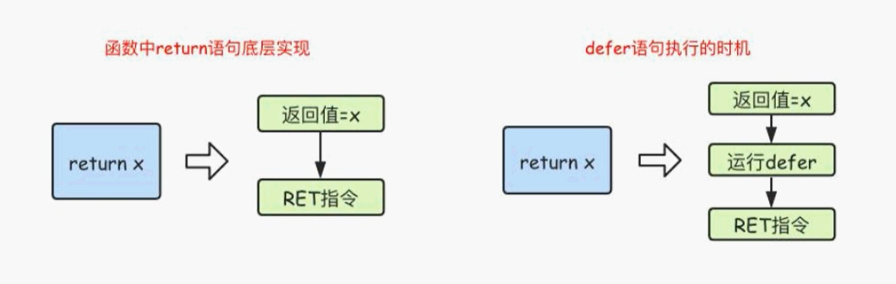

## 10.6.panic/revocer处理异常

Go语言中是没有异常机制，但是使用panic / recover模式来处理错误

- panic：可以在任何地方引发
- recover：只有在defer调用函数内有效

```go
func fn1() {
	fmt.Println("fn1")
}

func fn2() {
	panic("抛出一个异常")
}
func main() {
    fn1()
	fn2()
    fmt.Println("结束")
}
```

上述程序会直接抛出异常，无法正常运行

```bash
fn1
panic: 抛出一个异常
```

解决方法就是使用 recover进行异常的监听

```go
func fn1() {
	fmt.Println("fn1")
}

func fn2() {
	// 使用recover监听异常
	defer func() {
		err := recover()
		if err != nil {
			fmt.Println(err)
		}
	}()
	panic("抛出一个异常")
}
func main() {
    fn1()
	fn2()
    fmt.Println("结束")
}
```

## 10.7.异常运用场景

模拟一个读取文件的方法，这里可以主动发送使用panic  和 recover

```go
func readFile(fileName string) error {
	if fileName == "main.go" {
		return nil
	} else {
		return errors.New("读取文件失败")
	}
}

func myFn () {
	defer func() {
		e := recover()
		if e != nil {
			fmt.Println("给管理员发送邮件")
		}
	}()
	err := readFile("XXX.go")
	if err != nil {
		panic(err)
	}
}

func main() {
	myFn()
}
```

## 10.8.内置函数

| 内置函数      | 介绍                                                         |
| ------------- | ------------------------------------------------------------ |
| close         | 主要用来关闭channel                                          |
| len           | 用来求长度，比如string、array、slice、map、channel           |
| new           | 用来分配内存、主要用来分配值类型，比如 int、struct ，返回的是指针 |
| make          | 用来分配内存，主要用来分配引用类型，比如chan、map、slice     |
| append        | 用来追加元素到数组、slice中                                  |
| panic\recover | 用来处理错误                                                 |

# 11.指针

要搞明白Go语言中的指针需要先知道三个概念

- 指针地址
- 指针类型
- 指针取值

Go语言中的指针操作非常简单，我们只需要记住两个符号：&：取地址，*：根据地址取值

## 11.1.关于指针

我们知道变量是用来存储数据的，变量的本质是给存储数据的内存地址起了一个好记的别名。比如我们定义了一个变量a:=10，这个时候可以直接通过a这个变量来读取内存中保存的10这个值。在计算机底层a这个变量其实对应了一个内存地址。

指针也是一个变量，但它是一种特殊的变量，它存储的数据不是一个普通的值，而是另一个变量的内存地址。

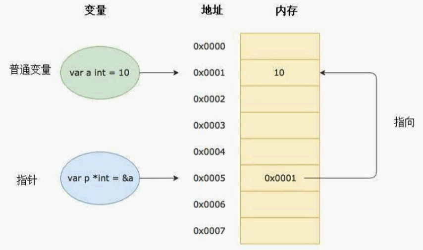

## 11.2.指针地址和指针类型

每个变量在运行时都拥有一个地址，这个地址代表变量在内存中的位置。Go 语言中使用&字符放在变量前面对变量进行取地址操作。Go语言中的值类型（int、float、bool、string、array、struct）都有对应的指针类型，如：

```
*int、，*int64、*string等
```

取变量指针的语法如下：

```go
ptr := &v
```

其中：

- v：代表被取地址的变量，类型为T
- ptr：用于接收地址的变量，ptr的类型就为*T，被称做T的指针类型。\* 代表指针

举个例子：

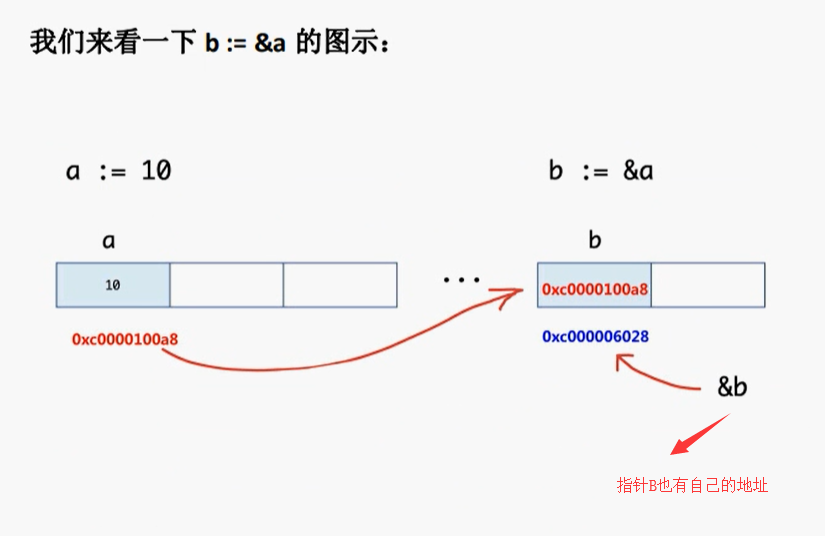

## 11.3.指针取值

在对普通变量进行&操作符取地址后，会获得这个变量指针，然后可以对指针使用*操作，也就是指针取值

```go
// 指针取值
var c = 20
// 得到c的地址，赋值给d
var d = &c
// 打印d的值，也就是c的地址
fmt.Println(d)
// 取出d指针所对应的值
fmt.Println(*d)
// c对应地址的值，改成30
*d = 30
// c已经变成30了
fmt.Println(c)
```

改变内存中的值，会直接改变原来的变量值

```go
// 这个类似于值传递
func fn4(x int) {
	x = 10
}
// 这个类似于引用数据类型
func fn5(x *int) {
	*x = 20
}
func main() {
	x := 5
	fn4(x)
	fmt.Println(x)
	fn5(&x)
	fmt.Println(x)
}
```

我们创建了两个方法，一个是传入局部变量，一个是传入指针类型，最后运行得到的结果

```bash
5
20
```

## 11.4.new和make函数

需要注意的是，指针必须在创建内存后才可以使用，这个和 slice 和 map是一样的

```go
// 引用数据类型map、slice等，必须使用make分配空间，才能够使用
var userInfo = make(map[string]string)
userInfo["userName"] = "zhangsan"
fmt.Println(userInfo)

var array = make([]int, 4, 4)
array[0] = 1
fmt.Println(array)
```

对于指针变量来说

```go
// 指针变量初始化
var a *int
*a = 100
fmt.Println(a)
```

执行上面的代码会引发panic，为什么呢？在Go语言中对于引用类型的变量，我们在使用的时候不仅要声明它，还要为它分配内存空间，否则我们的值就没办法存储。而对于值类型的声明不需要分配内存空间，是因为它们在声明的时候已经默认分配好了内存空间。要分配内存，就引出来今天的new和make。Go 语言中new和make是内建的两个函数，主要用来分配内存。

这个时候，我们就需要使用new关键字来分配内存，new是一个内置的函数，它的函数签名如下：

```go
func new(Type) *Type
```

其中

- Type表示类型，new函数只接受一个参数，这个参数是一个类型
- *Type表示类型指针，new函数返回一个指向该类型内存地址的指针

实际开发中new函数不太常用，使用new函数得到的是一个类型的指针，并且该指针对应的值为该类型的零值。举个例子：

```go
// 使用new关键字创建指针
aPoint := new(int)
bPoint := new(bool)
fmt.Printf("%T \n", aPoint)
fmt.Printf("%T \n", bPoint)
fmt.Println(*aPoint)
fmt.Println(*bPoint)
```

本节开始的示例代码中  var a *int 只是声明了一个指针变量a但是没有初始化，指针作为引用类型需要初始化后才会拥有内存空间，才可以给它赋值。应该按照如下方式使用内置的

## 11.5.make和new的区别

- 两者都是用来做内存分配的
- make只能用于slice、map以及channel的初始化，返回的还是这三个引用类型的本身
- 而new用于类型的内存分配，并且内存赌赢的值为类型的零值，返回的是指向类型的指针

# 12.结构体(Struct)

## 12.1.关于结构体

Golang中没有“类”的概念，Golang中的结构体和其他语言中的类有点相似。和其他面向对象语言中的类相比，Golang中的结构体具有更高的扩展性和灵活性。

Golang中的基础数据类型可以装示一些事物的基本属性，但是当我们想表达一个事物的全部或部分属性时，这时候再用单一的基本数据类型就无法满足需求了，Golang提供了一种自定义数据类型，可以封装多个基本数据类型，这种数据类型叫结构体，英文名称struct。也就是我们可以通过struct来定义自己的类型了。

## 12.2.Type关键字

Golang中通过type关键词定义一个结构体，需要注意的是，数组和结构体都是值类型，在这个和Java是有区别的

### 12.2.1.自定义类型

在Go语言中有一些基本的数据类型，如string、整型、浮点型、布尔等数据类型，Go语言中可以使用type关键字来定义自定义类型。

```go
type myInt int
```

上面代码表示：将mylnt定义为int类型，通过type关键字的定义，mylnt就是一种新的类型，它具有int的特性。

示例：如下所示，我们定义了一个myInt类型

```
type myInt int
func main() {
	var a myInt = 10
	fmt.Printf("%v %T", a, a)
}
```

输出查看它的值以及类型，能够发现该类型就是myInt类型

```go
10 main.myInt
```

除此之外，我们还可以定义一个方法类型

```go
func fun(x int, y int)int {
	return x + y
}
func main() {
	var fn myFn = fun
	fmt.Println(fn(1, 2))
}
```

然后调用并输出

```bash
3
```

### 12.2.2.类型别名

Golang1.9版本以后添加的新功能

类型别名规定：TypeAlias只是Type的别名，本质上TypeAlias与Type是同一个类型。就像一个孩子小时候有大名、小名、英文名，但这些名字都指的是他本人

```go
type TypeAlias = Type
```

我们之前见过的rune 和 byte 就是类型别名，他们的底层代码如下

```go
type byte = uint8
type rune = int32
```

## 12.3.结构体定义和初始化

### 12.3.1.结构体的定义

使用type  和 struct关键字来定义结构体，具体代码格式如下所示：

```go
/**
	定义一个人结构体
 */
type Person struct {
	name string
	age int
	sex string
}
func main() {
	// 实例化结构体
	var person Person
	person.name = "张三"
	person.age = 20
	person.sex = "男"
	fmt.Printf("%#v", person)
}
```

> 注意：结构体首字母可以大写也可以小写，大写表示这个结构体是公有的，在其它的包里面也可以使用，小写表示结构体属于私有的，在其它地方不能使用

例如：

```go
type Person struct {
	Name string
	Age int
	Sex string
}
```

### 12.3.2.实例化结构体

刚刚实例化结构体用到了：var person Person

```go
// 实例化结构体
var person Person
person.name = "张三"
person.age = 20
person.sex = "男"
```

### 12.3.3.实例化结构体2

我们下面使用另外一个方式来实例化结构体，通过new关键字来实例化结构体，得到的是结构体的地址，格式如下

```go
var person2 = new(Person)
person2.name = "李四"
person2.age = 30
person2.sex = "女"
fmt.Printf("%#v", person2)
```

输出如下所示，从打印结果可以看出person2是一个结构体指针

```bash
&main.Person{name:"李四", age:30, sex:"女"}
```

需要注意：在Golang中支持对结构体指针直接使用，来访问结构体的成员

```go
person2.name = "李四"
// 等价于
(*person2).name = "李四"
```

### 12.3.4.实例化结构体3

使用&对结构体进行取地址操作，相当于对该结构体类型进行了一次new实例化操作

```go
// 第三种方式实例化
var person3 = &Person{}
person3.name = "赵四"
person3.age = 28
person3.sex = "男"
fmt.Printf("%#v", person3)
```

### 12.3.5.实例化结构体4

使用键值对的方式来实例化结构体，实例化的时候，可以直接指定对应的值

```go
// 第四种方式初始化
var person4 = Person{
    name: "张三",
    age: 10,
    sex: "女",
}
fmt.Printf("%#v", person4)
```

### 12.3.6.实例化结构体5

第五种和第四种差不多，不过是用了取地址，然后返回的也是一个地址

```go
// 第五种方式初始化
var person5 = &Person{
    name: "孙五",
    age: 10,
    sex: "女",
}
fmt.Printf("%#v", person5)
```

### 12.3.7.实例化结构体6

第六种方式是可以简写结构体里面的key

```go
var person6 = Person{
    "张三",
    5,
    "女",
}
fmt.Println(person6)
```

## 12.4.结构体方法和接收者

在go语言中，没有类的概念但是可以给类型（结构体，自定义类型）定义方法。所谓方法就是定义了接收者的函数。接收者的概念就类似于其他语言中的this 或者self。

方法的定义格式如下：

```go
func (接收者变量 接收者类型) 方法名(参数列表)(返回参数) {
    函数体
}
```

**其中**

- 接收者变量：接收者中的参数变量名在命名时，官方建议使用接收者类型名的第一个小写字母，而不是self、this之类的命名。例如，Person类型的接收者变量应该命名为p，Connector类型的接收者变量应该命名为c等。、
- 接收者类型：接收者类型和参数类似，可以是指针类型和非指针类型。
  - 非指针类型：表示不修改结构体的内容
  - 指针类型：表示修改结构体中的内容
- 方法名、参数列表、返回参数：具体格式与函数定义相同

如果示例所示：

```go
/**
	定义一个人结构体
 */
type Person struct {
	name string
	age int
	sex string
}

// 定义一个结构体方法
func (p Person) PrintInfo() {
	fmt.Print(" 姓名: ", p.name)
	fmt.Print(" 年龄: ", p.age)
	fmt.Print(" 性别: ", p.sex)
	fmt.Println()
}
func (p *Person) SetInfo(name string, age int, sex string)  {
	p.name = name
	p.age = age
	p.sex = sex
}

func main() {
	var person = Person{
		"张三",
		18,
		"女",
	}
	person.PrintInfo()
	person.SetInfo("李四", 18, "男")
	person.PrintInfo()
}
```

运行结果为：

```bash
 姓名: 张三 年龄: 18 性别: 女
 姓名: 李四 年龄: 18 性别: 男
```


注意，因为结构体是值类型，所以我们修改的时候，因为是传入的指针

```go
func (p *Person) SetInfo(name string, age int, sex string)  {
	p.name = name
	p.age = age
	p.sex = sex
}
```

## 12.5.给任意类型添加方法

在Go语言中，接收者的类型可以是任何类型，不仅仅是结构体，任何类型都可以拥有方法。

举个例子，我们基于内置的int类型使用type关键字可以定义新的自定义类型，然后为我们的自定义类型添加方法。

```go
type myInt int
func fun(x int, y int)int {
	return x + y
}
func (m myInt) PrintInfo()  {
	fmt.Println("我是自定义类型里面的自定义方法")
}
func main() {
	var a myInt = 10
	fmt.Printf("%v %T \n", a, a)
	a.PrintInfo()
}
```

## 12.6.结构体的匿名字段

结构体允许其成员字段在声明时没有字段名而只有类型，这种没有名字的字段就被称为匿名字段

匿名字段默认采用类型名作为字段名，结构体要求字段名称必须唯一，因此一个结构体中同种类型的匿名字段只能一个

```go
/**
	定义一个人结构体
 */
type Person struct {
	string
	int
}

func main() {
	// 结构体的匿名字段
	var person = Person{
		"张三",
		18
	}
}
```

结构体的字段类型可以是：基本数据类型，也可以是切片、Map 以及结构体

如果结构体的字段类似是：指针、slice、和 map 的零值都是nil，即还没有分配空间

如果需要使用这样的字段，需要先make，才能使用

```go
/**
	定义一个人结构体
 */
type Person struct {
	name string
	age int
	hobby []string
	mapValue map[string]string
}

func main() {
	// 结构体的匿名字段
	var person = Person{}
	person.name = "张三"
	person.age = 10

	// 给切片申请内存空间
	person.hobby = make([]string, 4, 4)
	person.hobby[0] = "睡觉"
	person.hobby[1] = "吃饭"
	person.hobby[2] = "打豆豆"

	// 给map申请存储空间
	person.mapValue = make(map[string]string)
	person.mapValue["address"] = "北京"
	person.mapValue["phone"] = "123456789"

	// 加入#打印完整信息
	fmt.Printf("%#v", person)
}
```

同时我们还支持结构体的嵌套，如下所示

```go
// 用户结构体
type User struct {
	userName string
	password string
	sex string
	age int
	address Address // User结构体嵌套Address结构体
}

// 收货地址结构体
type Address struct {
	name string
	phone string
	city string
}

func main() {
	var u User
	u.userName = "moguBlog"
	u.password = "123456"
	u.sex = "男"
	u.age = 18
	
	var address Address
	address.name = "张三"
	address.phone = "110"
	address.city = "北京"
	u.address = address
	fmt.Printf("%#v", u)
}
```

## 12.7.嵌套结构体的字段名冲突

嵌套结构体内部可能存在相同的字段名，这个时候为了避免歧义，需要指定具体的内嵌结构体的字段。（例如，父结构体中的字段 和 子结构体中的字段相似）

默认会从父结构体中寻找，如果找不到的话，再去子结构体中在找

如果子类的结构体中，同时存在着两个相同的字段，那么这个时候就会报错了，因为程序不知道修改那个字段的为准。

## 12.8.结构体的继承

结构体的继承，其实就类似于结构体的嵌套，如下所示，我们定义了两个结构体，分别是Animal 和 Dog，其中每个结构体都有各自的方法，然后通过Dog结构体 继承于 Animal结构体

```go
// 用户结构体
type Animal struct {
	name string
}
func (a Animal) run() {
	fmt.Printf("%v 在运动 \n", a.name)
}
// 子结构体
type Dog struct {
	age int
	// 通过结构体嵌套，完成继承
	Animal
}
func (dog Dog) wang()  {
	fmt.Printf("%v 在汪汪汪 \n", dog.name)
}

func main() {
	var dog = Dog{
		age: 10,
		Animal: Animal{
			name: "阿帕奇",
		},
	}
	dog.run();
	dog.wang();
}
```

运行后，发现Dog拥有了父类的方法

```bash
阿帕奇 在运动 
阿帕奇 在汪汪汪
```

## 12.9.Go中的结构体和Json相互转换

JSON（JavaScript Object Notation）是一种轻量级的数据交换格式。易于人阅读和编写。同时也易于机器解析和生成。RESTfull Api接口中返回的数据都是json数据。

```json
{
    "name": "张三",
    "age": 15
}
```

比如我们Golang要给App或者小程序提供Api接口数据，这个时候就需要涉及到结构体和Json之间的相互转换
Golang JSON序列化是指把结构体数据转化成JSON格式的字符串，Golang JSON的反序列化是指把JSON数据转化成Golang中的结构体对象

Golang中的序列化和反序列化主要通过“encoding/json”包中的 json.Marshal() 和 son.Unmarshal()

```go
// 定义一个学生结构体，注意结构体的首字母必须大写，代表公有，否则将无法转换
type Student struct {
	ID string
	Gender string
	Name string
	Sno string
}
func main() {
	var s1 = Student{
		ID: "12",
		Gender: "男",
		Name: "李四",
		Sno: "s001",
	}
	// 结构体转换成Json（返回的是byte类型的切片）
	jsonByte, _ := json.Marshal(s1)
	jsonStr := string(jsonByte)
	fmt.Printf(jsonStr)
}
```

将字符串转换成结构体类型

```go
// 定义一个学生结构体，注意结构体的首字母必须大写，代表公有，否则将无法转换
type Student struct {
	ID string
	Gender string
	Name string
	Sno string
}
func main() {
	// Json字符串转换成结构体
	var str = `{"ID":"12","Gender":"男","Name":"李四","Sno":"s001"}`
	var s2 = Student{}
	// 第一个是需要传入byte类型的数据，第二参数需要传入转换的地址
	err := json.Unmarshal([]byte(str), &s2)
	if err != nil {
		fmt.Printf("转换失败 \n")
	} else {
		fmt.Printf("%#v \n", s2)
	}
}

```

### 12.9.1.注意

我们想要实现结构体转换成字符串，必须保证结构体中的字段是公有的，也就是首字母必须是大写的，这样才能够实现结构体 到 Json字符串的转换。

## 12.10.结构体标签Tag

Tag是结构体的元信息，可以在运行的时候通过反射的机制读取出来。Tag在结构体字段的后方定义，由一对反引号包裹起来，具体的格式如下：

```json
key1："value1" key2："value2"
```

结构体tag由一个或多个键值对组成。键与值使用冒号分隔，值用双引号括起来。同一个结构体字段可以设置多个键值对tag，不同的键值对之间使用空格分隔。

注意事项：为结构体编写Tag时，必须严格遵守键值对的规则。结构体标签的解析代码的容错能力很差，一旦格式写错，编译和运行时都不会提示任何错误，通过反射也无法正确取值。例如不要在key和value之间添加空格。

如下所示，我们通过tag标签，来转换字符串的key

```go
// 定义一个Student体，使用结构体标签
type Student2 struct {
	Id string `json:"id"` // 通过指定tag实现json序列化该字段的key
	Gender string `json:"gender"`
	Name string `json:"name"`
	Sno string `json:"sno"`
}
func main() {
	var s1 = Student2{
		Id: "12",
		Gender: "男",
		Name: "李四",
		Sno: "s001",
	}
	// 结构体转换成Json
	jsonByte, _ := json.Marshal(s1)
	jsonStr := string(jsonByte)
	fmt.Println(jsonStr)

	// Json字符串转换成结构体
	var str = `{"Id":"12","Gender":"男","Name":"李四","Sno":"s001"}`
	var s2 = Student2{}
	// 第一个是需要传入byte类型的数据，第二参数需要传入转换的地址
	err := json.Unmarshal([]byte(str), &s2)
	if err != nil {
		fmt.Printf("转换失败 \n")
	} else {
		fmt.Printf("%#v \n", s2)
	}
}
```

## 12.11.嵌套结构体和Json序列化反序列化

和刚刚类似，我们同样也是使用的是 json.Marshal()

```go
// 嵌套结构体 到 Json的互相转换

// 定义一个Student结构体
type Student3 struct {
	Id int
	Gender string
	Name string
}

// 定义一个班级结构体
type Class struct {
	Title string
	Students []Student3
}

func main() {
	var class = Class{
		Title: "1班",
		Students: make([]Student3, 0),
	}
	for i := 0; i < 10; i++ {
		s := Student3{
			Id: i + 1,
			Gender: "男",
			Name: fmt.Sprintf("stu_%v", i + 1),
		}
		class.Students = append(class.Students, s)
	}
	fmt.Printf("%#v \n", class)

	// 转换成Json字符串
	strByte, err := json.Marshal(class)
	if err != nil {
		fmt.Println("打印失败")
	} else {
		fmt.Println(string(strByte))
	}
}
```

# 13.Go中的包

## 13.1.Go中的包的介绍和定义

包（package）是多个Go源码的集合，是一种高级的代码复用方案，Go语言为我们提供了很多内置包，如fmt、strconv、strings、sort、errors、time、encoding/json、os、io等。

Golang中的包可以分为三种：1、系统内置包   2、自定义包   3、第三方包

- **系统内置包**：Golang 语言给我们提供的内置包，引入后可以直接使用，如fmt、strconv、strings、sort、errors、time、encoding/json、os、io等。
- **自定义包**：开发者自己写的包
- **第三方包**：属于自定义包的一种，需要下载安装到本地后才可以使用，如前面给大家介绍的
  "github.com/shopspring/decimal"包解决float精度丢失问题。

## 13.2.Go包管理工具 go mod

在Golang1.11版本之前如果我们要自定义包的话必须把项目放在GOPATH目录。Go1.11版本之后无需手动配置环境变量，使用go mod 管理项目，也不需要非得把项目放到GOPATH指定目录下，你可以在你磁盘的任何位置新建一个项目，Go1.13以后可以彻底不要GOPATH了。

### 13.2.1.go mod init初始化项目

实际项目开发中我们首先要在我们项目目录中用go mod命令生成一个go.mod文件管理我们项目的依赖。

比如我们的golang项目文件要放在了itying这个文件夹，这个时候我们需要在itying文件夹里面使用go mod命令生成一个go.mod文件

```
go mod init goProject
```


然后会生成一个 go.mod 的文件，里面的内容是go版本，以及以后添加的包

```go
module goProject

go 1.14
```

### 13.2.2.引入其它项目的包

首先我们创建一个 calc，然后里面有一个calc的文件

```go
package calc

// 自定义包，最好和文件夹统一起来

// 公有变量
var age = 10
// 私有变量
var Name = "张三"

// 首字母大写，表示共有方法
func Add(x, y int)int  {
	return x + y
}
func Sub(x, y int)int  {
	return x - y
}
```

在其它地方需要引用的话，就是这样

```go
package main
import (
	"fmt"
	"goProject/calc"
)
func main() {
	fmt.Printf("%v", calc.Add(2, 5))
}
```

## 13.3.Golang中自定义包

包（package）是多个Go源码的集合，一个包可以简单理解为一个存放多个.go文件的文件夹。该文件夹下面的所有go文件都要在代码的第一行添加如下代码，声明该文件归属的包。

```go
package 包名
```

**注意事项**

- 一个文件夹下面直接包含的文件只能归属一个package，同样一个package的文件不能在多个文件夹下。
- 包名可以不和文件夹的名字一样，包名不能包含-符号。
- 包名为main的包为应用程序的入口包，这种包编译后会得到一个可执行文件，而编译不包含main包的源代码则不会得到可执行文件。

## 13.4.Go中init()初始化函数

### 13.4.1.init函数介绍

在Go 语言程序执行时导入包语句会自动触发包内部init（）函数的调用。需要注意的是：init（）
函数没有参数也没有返回值。init（）函数在程序运行时自动被调用执行，不能在代码中主动调用它。
包初始化执行的顺序如下图所示：

包初始化执行的顺序如下图所示：

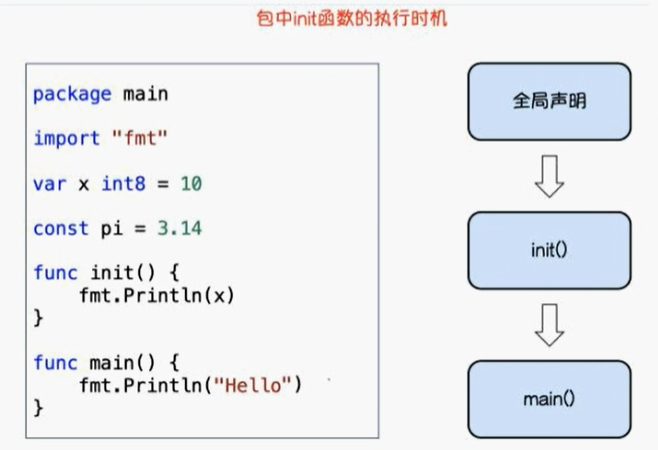

### 13.4.2.init函数执行顺序

Go语言包会从main包开始检查其导入的所有包，每个包中又可能导入了其他的包。Go编译器由此构建出一个树状的包引用关系，再根据引用顺序决定编译顺序，依次编译这些包的代码。

在运行时，被最后导入的包会最先初始化并调用其init（）函数，如下图示：

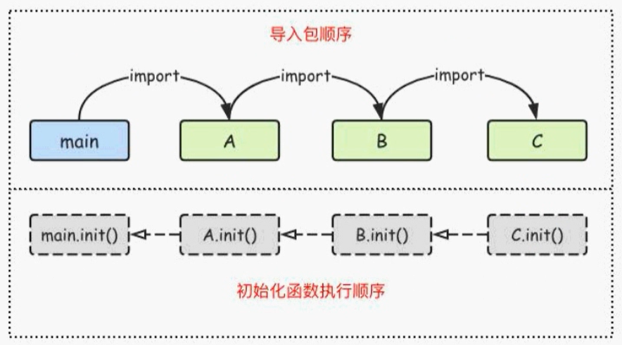

也就是父类中的init先执行

## 13.5.Go中的第三方包

我们可以在 https://pkg.go.dev/ 查找看常见的golang第三方包

例如，前面找到前面我们需要下载的第三方包的地址

```
https://github.com/shopspring/decimal
```

然后安装这个包

### 13.5.1.方法1：go get 包全名 （全局）

```bash
go get github.com/shopspring/decimal
```

### 13.5.2.方法2：go mod download （全局）

```bash
go mod download
```

依赖包会自动下载到 $GOPATH/pkg/mod目录，并且多个项目可以共享缓存的mod，注意使用go mod download的时候，需要首先在你的项目中引入第三方包

### 13.5.3.方法3：go mod vendor 将依赖复制到当前项目的vendor（本项目）

```bash
go mod vendor
```

将依赖复制到当前项目的vendor下

注意：使用go mod vendor的时候，首先需要在你的项目里面引入第三方包

### 13.5.4.go mod常见命令

- go download：下载依赖的module到本地cache
- go edit：编辑go.mod文件
- go graph：打印模块依赖图
- go init：在当前文件夹下初始化一个新的module，创建go.mod文件
- tidy：增加丢失的module，去掉未使用的module
- vendor：将依赖复制到vendor下
- verify：校验依赖，检查下载的第三方库有没有本地修改，如果有修改，则会返回非0，否则校验成功

## 13.6.安装依赖

首先我们先去官网找到这个包，https://github.com/shopspring/decimal

然后在我们的项目中引入

```go
import (
	"fmt"
	"github.com/shopspring/decimal"
	"goProject/calc"
)
func main() {
	fmt.Printf("%v \n", calc.Add(2, 5))
	// 打印公有变量
	fmt.Println(calc.Name)

	_, err := decimal.NewFromString("136.02")
	if err != nil {
		panic(err)
	}
}
```

引入后，我们运行项目，就会去下载了，下载完成后，我们到  go.mod文件夹，能够看到依赖被引入了

```go
module goProject

go 1.14

require github.com/shopspring/decimal v1.2.0 // indirect
```

同时还生成了一个 go.sum文件

```go
github.com/shopspring/decimal v1.2.0 h1:abSATXmQEYyShuxI4/vyW3tV1MrKAJzCZ/0zLUXYbsQ=
github.com/shopspring/decimal v1.2.0/go.mod h1:DKyhrW/HYNuLGql+MJL6WCR6knT2jwCFRcu2hWCYk4o=
```

这样我们就可以使用第三包开始具体的使用了~，我们实现一个Float类型的加法

```go
package main

import (
	"fmt"
	"github.com/shopspring/decimal"
)

func main() {
	var num1 float64 = 3.1
	var num2 float64 = 4.2
	d1 := decimal.NewFromFloat(num1).Add(decimal.NewFromFloat(num2))
	fmt.Println(d1)
}
```

# 14.Go中的接口

## 14.1.接口的介绍

现实生活中手机、相机、U盘都可以和电脑的USB接口建立连接。我们不需要关注usb卡槽大小是否一样，因为所有的USB接口都是按照统一的标准来设计的。


Golang中的接口是一种抽象数据类型，Golang中接口定义了对象的行为规范，只定义规范不实现。接口中定义的规范由具体的对象来实现。

通俗的讲接口就一个标准，它是对一个对象的行为和规范进行约定，约定实现接口的对象必须得按照接口的规范。

## Go接口的定义

在Golang中接口（interface）是一种类型，一种抽象的类型。接口（interface）是一组函数method的集合，Golang中的接口不能包含任何变量。

在Golang中接口中的所有方法都没有方法体，接口定义了一个对象的行为规范，只定义规范不实现。接口体现了程序设计的多态和高内聚低耦合的思想N Golang中的接口也是一种数据类型，不需要显示实现。只需要一个变量含有接口类型中的所有方法，那么这个变量就实现了这个接口。

Golang中每个接口由数个方法组成，接口的定义格式如下：

```go
type 接口名 interface {
    方法名1 (参数列表1) 返回值列表1
    方法名2 (参数列表2) 返回值列表2
}
```

**其中**

- **接口名**：使用type将接口定义为自定义的类型名。Go语言的接口在命名时，一般会在单词后面添加er，如有写操作的接口叫Writer，有字符串功能的接口叫Stringer等，接口名最好突出该接口的类型含义。
- **方法名**：当方法名首字母是大写且这个接口类型名首字母也是大写时，这个方法可以被接口所在的包（package）之外的代码访问。
- **参数列表、返回值列表**：参数列表和返回值列表中的参数变量名是可以省略

演示：定义一个Usber接口让Phone 和 Camera结构体实现这个接口

首先我们定义一个Usber接口，接口里面就定义了两个方法

```
// 定义一个Usber接口
type Usber interface {
	start()
	stop()
}
```

然后我们在创建一个手机结构体

```go
// 如果接口里面有方法的话，必须要通过结构体或自定义类型实现这个接口

// 使用结构体来实现 接口
type Phone struct {
	Name string
}
// 手机要实现Usber接口的话，必须实现usb接口的所有方法
func (p Phone) Start()  {
	fmt.Println(p.Name, "启动")
}
func (p Phone) Stop()  {
	fmt.Println(p.Name, "关闭")
}
```

然后我们在创建一个Phone的结构体，来实现这个接口

```go
// 如果接口里面有方法的话，必须要通过结构体或自定义类型实现这个接口

// 使用结构体来实现 接口
type Phone struct {
	Name string
}
// 手机要实现Usber接口的话，必须实现usb接口的所有方法
func (p Phone) start()  {
	fmt.Println(p.Name, "启动")
}
func (p Phone) stop()  {
	fmt.Println(p.Name, "关闭")
}
func main() {
	var phone Usber = Phone{
		"三星手机",
	}
	phone.start()
	phone.stop()
}
```

我们在创建一个Camera结构体

```go
// 使用相机结构体来实现 接口
type Camera struct {
	Name string
}
// 相机要实现Usber接口的话，必须实现usb接口的所有方法
func (p Camera) start()  {
	fmt.Println(p.Name, "启动")
}
func (p Camera) stop()  {
	fmt.Println(p.Name, "关闭")
}
func main() {
	var camera Usber = Camera{
		"佳能",
	}
	camera.start()
	camera.stop()
}
```

我们创建一个电脑的结构体，电脑的结构体就是用于接收两个实现了Usber的结构体，然后让其工作

```go
// 电脑
type Computer struct {

}

// 接收一个实现了Usber接口的 结构体
func (computer Computer) Startup(usb Usber)  {
	usb.start()
}

// 关闭
func (computer Computer) Shutdown (usb Usber)  {
	usb.stop()
}
```

最后我们在main中调用方法

```go
func main() {
	var camera interfaceDemo.Camera = interfaceDemo.Camera{
		"佳能",
	}
	var phone interfaceDemo.Phone = interfaceDemo.Phone{
		"苹果",
	}

	var computer interfaceDemo.Computer = interfaceDemo.Computer{}
	computer.Startup(camera)
	computer.Startup(phone)
	computer.Shutdown(camera)
	computer.Shutdown(phone)
}
```

运行结果如下所示：

```bash
佳能 启动
苹果 启动
佳能 关闭
苹果 关闭
```

## 空接口（Object类型）

Golang中的接口可以不定义任何方法，没有定义任何方法的接口就是空接口。空接口表示没有任何约束，因此任何类型变量都可以实现空接口。

空接口在实际项目中用的是非常多的，用空接口可以表示任意数据类型。

```go
// 空接口表示没有任何约束，任意的类型都可以实现空接口
type EmptyA interface {

}

func main() {
	var a EmptyA
	var str = "你好golang"
	// 让字符串实现A接口
	a = str
	fmt.Println(a)
}
```

同时golang中空接口也可以直接当做类型来使用，可以表示任意类型。相当于Java中的Object类型

```go
var a interface{}
a = 20
a = "hello"
a = true
```

空接口可以作为函数的参数，使用空接口可以接收任意类型的函数参数

```go
// 空接口作为函数参数
func show(a interface{}) {
    fmt.println(a)
}
```

### map的值实现空接口

使用空接口实现可以保存任意值的字典

```go
// 定义一个值为空接口类型
var studentInfo = make(map[string]interface{})
studentInfo["userName"] = "张三"
studentInfo["age"] = 15
studentInfo["isWork"] = true
```

### slice切片实现空接口

```go
// 定义一个空接口类型的切片
var slice = make([]interface{}, 4, 4)
slice[0] = "张三"
slice[1] = 1
slice[2] = true
```

## 类型断言

一个接口的值（简称接口值）是由一个具体类型和具体类型的值两部分组成的。这两部分分别称为接口的动态类型和动态值。

如果我们想要判断空接口中值的类型，那么这个时候就可以使用类型断言，其语法格式：

```bash
x.(T)
```

其中：

- X：表示类型为interface{}的变量
- T：表示断言x可能是的类型

该语法返回两个参数，第一个参数是x转化为T类型后的变量，第二个值是一个布尔值，若为true则表示断言成功，为false则表示断言失败

```go
// 类型断言
var a interface{}
a = "132"
value, isString := a.(string)
if isString {
    fmt.Println("是String类型, 值为：", value)
} else {
    fmt.Println("断言失败")
}
```

或者我们可以定义一个能传入任意类型的方法

```go
// 定义一个方法，可以传入任意数据类型，然后根据不同类型实现不同的功能
func Print(x interface{})  {
	if _,ok := x.(string); ok {
		fmt.Println("传入参数是string类型")
	} else if _, ok := x.(int); ok {
		fmt.Println("传入参数是int类型")
	} else {
		fmt.Println("传入其它类型")
	}
}
```

上面的示例代码中，如果要断言多次，那么就需要写很多if，这个时候我们可以使用switch语句来实现：

**注意：** 类型.(type) 只能结合switch语句使用

```go
func Print2(x interface{})  {
	switch x.(type) {
	case int:
		fmt.Println("int类型")
	case string:
		fmt.Println("string类型")
	case bool:
		fmt.Println("bool类型")
	default:
		fmt.Println("其它类型")
	}
}
```

## 结构体接收者

### 值接收者

如果结构体中的方法是值接收者，那么实例化后的结构体值类型和结构体指针类型都可以赋值给接口变量

## 结构体实现多个接口

实现多个接口的话，可能就同时用两个接口进行结构体的接受

```go
// 定义一个Animal的接口，Animal中定义了两个方法，分别是setName 和 getName，分别让DOg结构体和Cat结构体实现
type Animal interface {
	SetName(string)
}

// 接口2
type Animal2 interface {
	GetName()string
}

type Dog struct {
	Name string
}

func (d *Dog) SetName(name string)  {
	d.Name = name
}
func (d Dog)GetName()string {
	return d.Name
}

func main() {
	var dog = &Dog{
		"小黑",
	}
	// 同时实现两个接口
	var d1 Animal = dog
	var d2 Animal2 = dog
	d1.SetName("小鸡")
	fmt.Println(d2.GetName())
}
```

## 接口嵌套

在golang中，允许接口嵌套接口，我们首先创建一个 Animal1 和 Animal2 接口，然后使用Animal接受刚刚的两个接口，实现接口的嵌套。

```go
// 定义一个Animal的接口，Animal中定义了两个方法，分别是setName 和 getName，分别让DOg结构体和Cat结构体实现
type Animal1 interface {
	SetName(string)
}

// 接口2
type Animal2 interface {
	GetName()string
}

type Animal interface {
	Animal1
	Animal2
}

type Dog struct {
	Name string
}

func (d *Dog) SetName(name string)  {
	d.Name = name
}
func (d Dog)GetName()string {
	return d.Name
}

func main() {
	var dog = &Dog{
		"小黑",
	}
	// 同时实现两个接口
	var d Animal = dog
	d.SetName("小鸡")
	fmt.Println(d.GetName())
}
```

## Golang中空接口和类型断言

```go
// golang中空接口和类型断言
var userInfo = make(map[string]interface{})
userInfo["userName"] = "zhangsan"
userInfo["age"] = 10
userInfo["hobby"] = []string{"吃饭", "睡觉"}
fmt.Println(userInfo["userName"])
fmt.Println(userInfo["age"])
fmt.Println(userInfo["hobby"])
// 但是我们空接口如何获取数组中的值？发现 userInfo["hobby"][0]  这样做不行
// fmt.Println(userInfo["hobby"][0])
```

也就是我们的空接口，无法直接通过索引获取数组中的内容，因此这个时候就需要使用类型断言了

```go
// 这个时候我们就可以使用类型断言了
hobbyValue,ok := userInfo["hobby"].([]string)
if ok {
    fmt.Println(hobbyValue[0])
}
```

通过类型断言返回来的值，我们就能够直接通过角标获取了。

# Golang goroutine channel 实现并发和并行

## 为什么要使用goroutine呢

需求：要统计1-10000000的数字中那些是素数，并打印这些素数？

素数：就是除了1和它本身不能被其他数整除的数

**实现方法：**

- 传统方法，通过一个for循环判断各个数是不是素数
- 使用并发或者并行的方式，将统计素数的任务分配给多个goroutine去完成，这个时候就用到了goroutine
- goroutine 结合 channel

## 进程、线程以及并行、并发

### 进程

进程（Process）就是程序在操作系统中的一次执行过程，是系统进行资源分配和调度的基本单位，进程是一个动态概念，是程序在执行过程中分配和管理资源的基本单位，每一个进程都有一个自己的地址空间。一个进程至少有5种基本状态，它们是：初始态，执行态，等待状态，就绪状态，终止状态。

通俗的讲进程就是一个正在执行的程序。

### 线程

线程是进程的一个执行实例，是程序执行的最小单元，它是比进程更小的能独立运行的基本单位

一个进程可以创建多个线程，同一个进程中多个线程可以并发执行 ，一个线程要运行的话，至少有一个进程

### 并发和并行

并发：多个线程同时竞争一个位置，竞争到的才可以执行，每一个时间段只有一个线程在执行。

并行：多个线程可以同时执行，每一个时间段，可以有多个线程同时执行。

通俗的讲多线程程序在单核CPU上面运行就是并发，多线程程序在多核CUP上运行就是并行，如果线程数大于CPU核数，则多线程程序在多个CPU上面运行既有并行又有并发

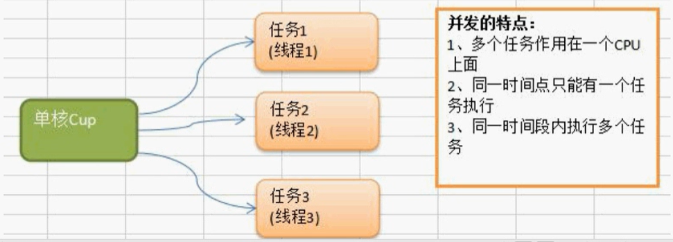


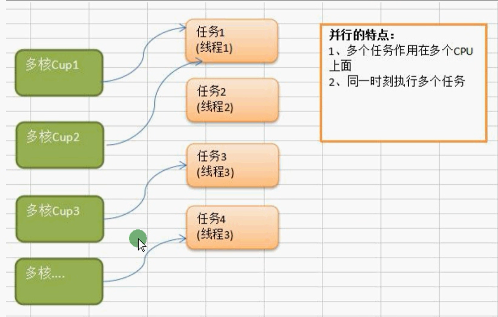


## Golang中协程（goroutine）以及主线程

golang中的主线程：（可以理解为线程/也可以理解为进程），在一个Golang程序的主线程上可以起多个协程。Golang中多协程可以实现并行或者并发。

**协程**：可以理解为用户级线程，这是对内核透明的，也就是系统并不知道有协程的存在，是完全由用户自己的程序进行调度的。Golang的一大特色就是从语言层面原生持协程，在函数或者方法前面加go关键字就可创建一个协程。可以说Golang中的协程就是goroutine。

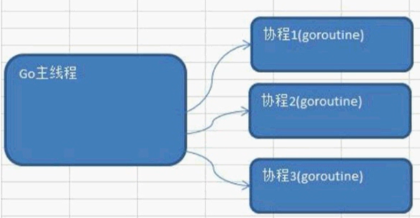

Golang中的多协程有点类似于Java中的多线程

### 多协程和多线程

多协程和多线程：Golang中每个goroutine（协程）默认占用内存远比Java、C的线程少。

OS线程（操作系统线程）一般都有固定的栈内存（通常为2MB左右），一个goroutine（协程）占用内存非常小，只有2KB左右，多协程goroutine切换调度开销方面远比线程要少。

这也是为什么越来越多的大公司使用Golang的原因之一。

## goroutine的使用以及sync.WaitGroup

### 并行执行需求

在主线程（可以理解成进程）中，开启一个goroutine，该协程每隔50毫秒秒输出“你好golang"

在主线程中也每隔50毫秒输出“你好golang"，输出10次后，退出程序，要求主线程和goroutine同时执行。

这是时候，我们就可以开启协程来了，通过 go关键字开启

```go
// 协程需要运行的方法
func test()  {
	for i := 0; i < 5; i++ {
		fmt.Println("test 你好golang")
		time.Sleep(time.Millisecond * 100)
	}
}
func main() {

	// 通过go关键字，就可以直接开启一个协程
	go test()

	// 这是主进程执行的
	for i := 0; i < 5; i++ {
		fmt.Println("main 你好golang")
		time.Sleep(time.Millisecond * 100)
	}
}
```

运行结果如下，我们能够看到他们之间不存在所谓的顺序关系了

```go
main 你好golang
test 你好golang
main 你好golang
test 你好golang
test 你好golang
main 你好golang
main 你好golang
test 你好golang
test 你好golang
main 你好golang
```

但是上述的代码其实还有问题的，也就是说当主进程执行完毕后，不管协程有没有执行完成，都会退出

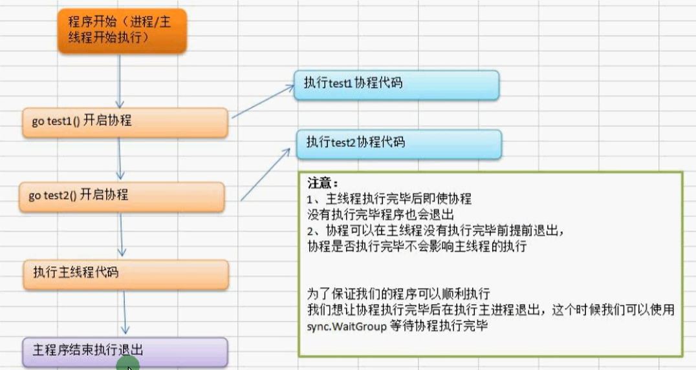

这是使用我们就需要用到  sync.WaitGroup等待协程

首先我们需要创建一个协程计数器

```go
// 定义一个协程计数器
var wg sync.WaitGroup
```

然后当我们开启协程的时候，我们要让计数器加1

```go
// 开启协程，协程计数器加1
wg.Add(1)
go test2()
```

当我们协程结束前，我们需要让计数器减1

```go
// 协程计数器减1
wg.Done()
```

完整代码如下

```go
// 定义一个协程计数器
var wg sync.WaitGroup

func test()  {
	// 这是主进程执行的
	for i := 0; i < 1000; i++ {
		fmt.Println("test1 你好golang", i)
		//time.Sleep(time.Millisecond * 100)
	}
	// 协程计数器减1
	wg.Done()
}

func test2()  {
	// 这是主进程执行的
	for i := 0; i < 1000; i++ {
		fmt.Println("test2 你好golang", i)
		//time.Sleep(time.Millisecond * 100)
	}
	// 协程计数器减1
	wg.Done()
}

func main() {

	// 通过go关键字，就可以直接开启一个协程
	wg.Add(1)
	go test()

	// 协程计数器加1
	wg.Add(1)
	go test2()

	// 这是主进程执行的
	for i := 0; i < 1000; i++ {
		fmt.Println("main 你好golang", i)
		//time.Sleep(time.Millisecond * 100)
	}
	// 等待所有的协程执行完毕
	wg.Wait()
	fmt.Println("主线程退出")
}
```

## 设置Go并行运行的时候占用的cpu数量

Go运行时的调度器使用GOMAXPROCS参数来确定需要使用多少个OS线程来同时执行Go代码。默认值是机器上的CPU核心数。例如在一个8核心的机器上，调度器会把Go代码同时调度到8个oS线程上。

Go 语言中可以通过runtime.GOMAXPROCS（）函数设置当前程序并发时占用的CPU逻辑核心数。

Go1.5版本之前，默认使用的是单核心执行。Go1.5版本之后，默认使用全部的CPU逻辑核心数。

```go
func main() {
	// 获取cpu个数
	npmCpu := runtime.NumCPU()
	fmt.Println("cup的个数:", npmCpu)
	// 设置允许使用的CPU数量
	runtime.GOMAXPROCS(runtime.NumCPU() - 1)
}
```

## for循环开启多个协程

类似于Java里面开启多个线程，同时执行

```go
func test(num int)  {
	for i := 0; i < 10; i++ {
		fmt.Printf("协程（%v）打印的第%v条数据 \n", num, i)
	}
	// 协程计数器减1
	vg.Done()
}

var vg sync.WaitGroup

func main() {
	for i := 0; i < 10; i++ {
		go test(i)
		vg.Add(1)
	}
	vg.Wait()
	fmt.Println("主线程退出")
}
```

因为我们协程会在主线程退出后就终止，所以我们还需要使用到  sync.WaitGroup来控制主线程的终止。

## Channel管道

管道是Golang在语言级别上提供的goroutine间的通讯方式，我们可以使用channel在多个goroutine之间传递消息。如果说goroutine是Go程序并发的执行体，channel就是它们之间的连接。channel是可以让一个goroutine发送特定值到另一个goroutine的通信机制。

Golang的并发模型是CSP（Communicating Sequential Processes），提倡通过通信共享内存而不是通过共享内存而实现通信。

Go语言中的管道（channel）是一种特殊的类型。管道像一个传送带或者队列，总是遵循先入先出（First In First Out）的规则，保证收发数据的顺序。每一个管道都是一个具体类型的导管，也就是声明channel的时候需要为其指定元素类型。

### channel类型

channel是一种类型，一种引用类型。声明管道类型的格式如下：

```go
// 声明一个传递整型的管道
var ch1 chan int
// 声明一个传递布尔类型的管道
var ch2 chan bool
// 声明一个传递int切片的管道
var ch3 chan []int
```

### 创建channel

声明管道后，需要使用make函数初始化之后才能使用

```go
make(chan 元素类型, 容量)
```

举例如下：

```go
// 创建一个能存储10个int类型的数据管道
ch1 = make(chan int, 10)
// 创建一个能存储4个bool类型的数据管道
ch2 = make(chan bool, 4)
// 创建一个能存储3个[]int切片类型的管道
ch3 = make(chan []int, 3)
```

### channel操作

管道有发送，接收和关闭的三个功能

发送和接收 都使用 <- 符号

现在我们先使用以下语句定义一个管道：

```go
ch := make(chan int, 3)
```

#### 发送

将数据放到管道内，将一个值发送到管道内

```go
// 把10发送到ch中
ch <- 10
```

#### 取操作

```go
x := <- ch
```

#### 关闭管道.

通过调用内置的close函数来关闭管道

```go
close(ch)
```


#### 完整示例

```go
// 创建管道
ch := make(chan int, 3)

// 给管道里面存储数据
ch <- 10
ch <- 21
ch <- 32

// 获取管道里面的内容
a := <- ch
fmt.Println("打印出管道的值：", a)
fmt.Println("打印出管道的值：", <- ch)
fmt.Println("打印出管道的值：", <- ch)

// 管道的值、容量、长度
fmt.Printf("地址：%v 容量：%v 长度：%v \n", ch, cap(ch), len(ch))

// 管道的类型
fmt.Printf("%T \n", ch)

// 管道阻塞（当没有数据的时候取，会出现阻塞，同时当管道满了，继续存也会）
<- ch  // 没有数据取，出现阻塞
ch <- 10
ch <- 10
ch <- 10
ch <- 10 // 管道满了，继续存，也出现阻塞
```

## for range从管道循环取值

当向管道中发送完数据时，我们可以通过close函数来关闭管道，当管道被关闭时，再往该管道发送值会引发panic，从该管道取值的操作会去完管道中的值，再然后取到的值一直都是对应类型的零值。那如何判断一个管道是否被关闭的呢？

```go
// 创建管道
ch := make(chan int, 10)
// 循环写入值
for i := 0; i < 10; i++ {
    ch <- i
}
// 关闭管道
close(ch)

// for range循环遍历管道的值(管道没有key)
for value := range ch {
    fmt.Println(value)
}
// 通过上述的操作，能够打印值，但是出出现一个deadlock的死锁错误，也就说我们需要关闭管道
```

注意：使用for range遍历的时候，一定在之前需要先关闭管道

思考：通过for循环来遍历管道，需要关闭么？

```go
// 创建管道
ch := make(chan int, 10)
// 循环写入值
for i := 0; i < 10; i++ {
    ch <- i
}

for i := 0; i < 10; i++ {
    fmt.Println(<- ch)
}
```

上述代码没有报错，说明通过for i的循环方式，可以不关闭管道

## Goroutine 结合 channel 管道

需求1：定义两个方法，一个方法给管道里面写数据，一个给管道里面读取数据。要求同步进行。

- 开启一个fn1的的协程给向管道inChan中写入00条数据
- 开启一个fn2的协程读取inChan中写入的数据
- 注意：fn1和fn2同时操作一个管道
- 主线程必须等待操作完成后才可以退出

```go
func write(ch chan int)  {
	for i := 0; i < 10; i++ {
		fmt.Println("写入:", i)
		ch <- i
		time.Sleep(time.Microsecond * 10)
	}
	wg.Done()
}
func read(ch chan int)  {
	for i := 0; i < 10; i++ {
		fmt.Println("读取:", <- ch)
		time.Sleep(time.Microsecond * 10)
	}
	wg.Done()
}
var wg sync.WaitGroup
func main() {
	ch := make(chan int, 10)
	wg.Add(1)
	go write(ch)
	wg.Add(1)
	go read(ch)

	// 等待
	wg.Wait()
	fmt.Println("主线程执行完毕")
}
```

管道是安全的，是一边写入，一边读取，当读取比较快的时候，会等待写入

## goroutine 结合 channel打印素数

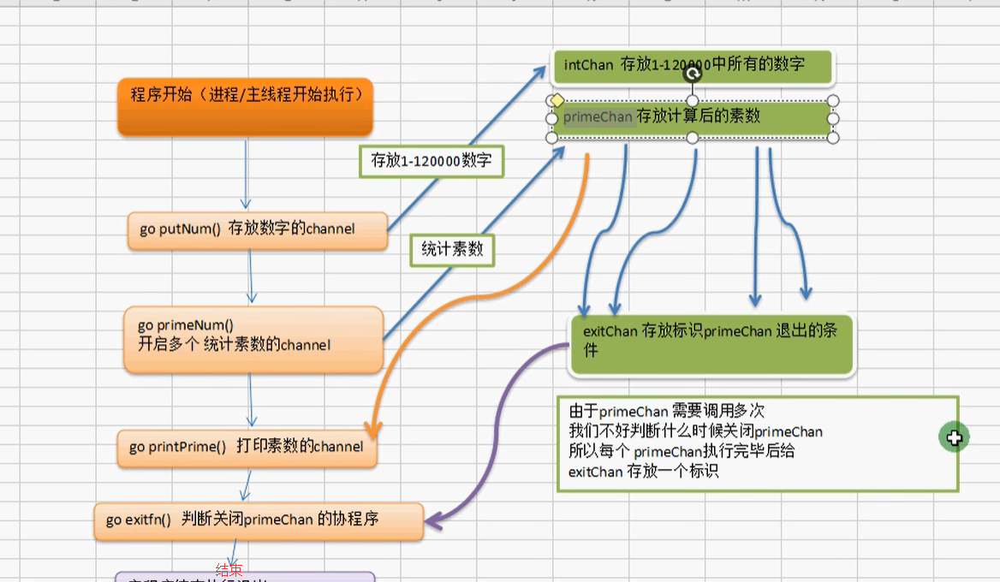

```go
// 想intChan中放入 1~ 120000个数
func putNum(intChan chan int)  {
	for i := 2; i < 120000; i++ {
		intChan <- i
	}
	wg.Done()
	close(intChan)
}

// cong intChan取出数据，并判断是否为素数，如果是的话，就把得到的素数放到primeChan中
func primeNum(intChan chan int, primeChan chan int, exitChan chan bool)  {
	for value := range intChan {
		var flag = true
		for i := 2; i <= int(math.Sqrt(float64(value))); i++ {
			if  i % i == 0 {
				flag = false
				break
			}
		}
		if flag {
			// 是素数
			primeChan <- value
			break
		}
	}

	// 这里需要关闭 primeChan，因为后面需要遍历输出 primeChan
	exitChan <- true

	wg.Done()
}

// 打印素数
func printPrime(primeChan chan int)  {
	for value := range primeChan {
		fmt.Println(value)
	}
	wg.Done()
}


var wg sync.WaitGroup
func main() {
	// 写入数字
	intChan := make(chan int, 1000)

	// 存放素数
	primeChan := make(chan int, 1000)

	// 存放 primeChan退出状态
	exitChan := make(chan bool, 16)

	// 开启写值的协程
	go putNum(intChan)

	// 开启计算素数的协程
	for i := 0; i < 10; i++ {
		wg.Add(1)
		go primeNum(intChan, primeChan, exitChan)
	}

	// 开启打印的协程
	wg.Add(1)
	go printPrime(primeChan)

	// 匿名自运行函数
	wg.Add(1)
	go func() {
		for i := 0; i < 16; i++ {
			// 如果exitChan 没有完成16次遍历，将会等待
			<- exitChan
		}
		// 关闭primeChan
		close(primeChan)
		wg.Done()
	}()

	wg.Wait()
	fmt.Println("主线程执行完毕")
	
}
```

## 单向管道

有时候我们会将管道作为参数在多个任务函数间传递，很多时候我们在不同的任务函数中，使用管道都会对其进行限制，比如限制管道在函数中只能发送或者只能接受

> 默认的管道是 可读可写

```go
// 定义一种可读可写的管道
var ch = make(chan int, 2)
ch <- 10
<- ch

// 管道声明为只写管道，只能够写入，不能读
var ch2 = make(chan<- int, 2)
ch2 <- 10

// 声明一个只读管道
var ch3 = make(<-chan int, 2)
<- ch3
```

## Select多路复用

在某些场景下我们需要同时从多个通道接收数据。这个时候就可以用到golang中给我们提供的select多路复用。
通常情况通道在接收数据时，如果没有数据可以接收将会发生阻塞。

比如说下面代码来实现从多个通道接受数据的时候就会发生阻塞

这种方式虽然可以实现从多个管道接收值的需求，但是运行性能会差很多。为了应对这种场景，Go内置了select关键字，可以同时响应多个管道的操作。

select的使用类似于switch 语句，它有一系列case分支和一个默认的分支。每个case会对应一个管道的通信（接收或发送）过程。select会一直等待，直到某个case的通信操作完成时，就会执行case分支对应的语句。具体格式如下：

```go
intChan := make(chan int, 10)
intChan <- 10
intChan <- 12
intChan <- 13
stringChan := make(chan int, 10)
stringChan <- 20
stringChan <- 23
stringChan <- 24

// 每次循环的时候，会随机中一个chan中读取，其中for是死循环
for {
    select {
        case v:= <- intChan:
        fmt.Println("从initChan中读取数据：", v)
        case v:= <- stringChan:
        fmt.Println("从stringChan中读取数据：", v)
        default:
        fmt.Println("所有的数据获取完毕")
        return
    }
}
```

> tip：使用select来获取数据的时候，不需要关闭chan，不然会出现问题

## Goroutine Recover解决协程中出现的Panic

```go
func sayHello()  {
	for i := 0; i < 10; i++ {
		fmt.Println("hello")
	}
}
func errTest()  {
	// 捕获异常
	defer func() {
		if err := recover(); err != nil {
			fmt.Println("errTest发生错误")
		}
	}()
	var myMap map[int]string
	myMap[0] = "10"
}
func main {
    go sayHello()
    go errTest()
}
```

当我们出现问题的时候，我们还是按照原来的方法，通过defer func创建匿名自启动

```go
// 捕获异常
defer func() {
    if err := recover(); err != nil {
        fmt.Println("errTest发生错误")
    }
}()
```

## Go中的并发安全和锁

如下面一段代码，我们在并发环境下进行操作，就会出现并发访问的问题

```go
var count = 0
var wg sync.WaitGroup

func test()  {
	count++
	fmt.Println("the count is : ", count)
	time.Sleep(time.Millisecond)
	wg.Done()
}
func main() {
	for i := 0; i < 20; i++ {
		wg.Add(1)
		go test()
	}
	time.Sleep(time.Second * 10)
}
```

### 互斥锁

互斥锁是传统并发编程中对共享资源进行访问控制的主要手段，它由标准库sync中的Mutex结构体类型表示。sync.Mutex类型只有两个公开的指针方法，Lock和Unlock。Lock锁定当前的共享资源，Unlock 进行解锁

```go
// 定义一个锁
var mutex sync.Mutex
// 加锁
mutex.Lock()
// 解锁
mutex.Unlock()
```

完整代码

```go
var count = 0
var wg sync.WaitGroup
var mutex sync.Mutex

func test()  {
	// 加锁
	mutex.Lock()
	count++
	fmt.Println("the count is : ", count)
	time.Sleep(time.Millisecond)
	wg.Done()
	// 解锁
	mutex.Unlock()
}
func main() {
	for i := 0; i < 20; i++ {
		wg.Add(1)
		go test()
	}
	time.Sleep(time.Second * 10)
}
```

通过下面命令，build的时候，可以查看是否具有竞争关系

```go
// 通过 -race 参数进行构建
go build -race main.go
// 运行插件
main.ext
```

### 读写互斥锁

互斥锁的本质是当一个goroutine访问的时候，其他goroutine都不能访问。这样在资源同步，避免竞争的同时也降低了程序的并发性能。程序由原来的并行执行变成了串行执行。

其实，当我们对一个不会变化的数据只做“读”操作的话，是不存在资源竞争的问题的。因为数据是不变的，不管怎么读取，多少goroutine同时读取，都是可以的。

所以问题不是出在“读”上，主要是修改，也就是“写”。修改的数据要同步，这样其他goroutine才可以感知到。所以真正的互斥应该是读取和修改、修改和修改之间，读和读是没有互斥操作的必要的。

因此，衍生出另外一种锁，叫做读写锁。

读写锁可以让多个读操作并发，同时读取，但是对于写操作是完全互斥的。也就是说，当一个goroutine进行写操作的时候，其他goroutine既不能进行读操作，也不能进行写操作。

GO中的读写锁由结构体类型sync.RWMutex表示。此类型的方法集合中包含两对方法：

# Go中的反射

## 反射

有时我们需要写一个函数，这个函数有能力统一处理各种值类型，而这些类型可能无法共享同一个接口，也可能布局未知，也有可能这个类型在我们设计函数时还不存在，这个时候我们就可以用到反射。

空接口可以存储任意类型的变量，那我们如何知道这个空接口保存数据的类型是什么？
值是什么呢？

- 可以使用类型断言
- 可以使用反射实现，也就是在程序运行时动态的获取一个变量的类型信息和值信息。

把结构体序列化成json字符串，自定义结构体Tab标签的时候就用到了反射

后面所说的ORM框架，底层就是用到了反射技术

ORM：对象关系映射（Object Relational Mapping，简称 ORM）是通过使用描述对象和数据库之间的映射的元数据，将面向对象语言程序中的对象自动持久化到关系数据库中。

## 反射的基本介绍

反射是指在程序运行期间对程序本身进行访问和修改的能力。正常情况程序在编译时，变量被转换为内存地址，变量名不会被编译器写入到可执行部分。在运行程序时，程序无法获取自身的信息。支持反射的语言可以在程序编译期将变量的反射信息，如字段名称、类型信息、结构体信息等整合到可执行文件中，并给程序提供接口访问反射信息，这样就可以在程序运行期获取类型的反射信息，并且有能力修改它们。

## Go可以实现的功能

- 反射可以在程序运行期间动态的获取变量的各种信息，比如变量的类型类别
- 如果是结构体，通过反射还可以获取结构体本身的信息，比如结构体的字段、结构体的方法。
- 通过反射，可以修改变量的值，可以调用关联的方法

Go语言中的变量是分为两部分的：

- 类型信息：预先定义好的元信息。
- 值信息：程序运行过程中可动态变化的。

在Go语言的反射机制中，任何接口值都由是一个具体类型和具体类型的值两部分组成的。

在Go语言中反射的相关功能由内置的reflect包提供，任意接口值在反射中都可以理解为由 reflect.Type 和 reflect.Value两部分组成，并且reflect包提供了reflect.TypeOf和reflect.ValueOf两个重要函数来获取任意对象的Value 和 Type

## reflect.TypeOf()获取任意值的类型对象

在Go 语言中，使用reflect.TypeOf（）函数可以接受任意interface}参数，可以获得任意值的类型对象（reflect.Type），程序通过类型对象可以访问任意值的类型信息。

通过反射获取空接口的类型

```go
func reflectFun(x interface{})  {
	v := reflect.TypeOf(x)
	fmt.Println(v)
}
func main() {
	reflectFun(10)
	reflectFun(10.01)
	reflectFun("abc")
	reflectFun(true)
}
```

## type name 和 type Kind

在反射中关于类型还划分为两种：类型（Type）和种类（Kind）。因为在Go语言中我们可以使用type关键字构造很多自定义类型，而种类（Kid）就是指底层的类型，但在反射中，当需要区分指针、结构体等大品种的类型时，就会用到种类（Kind）。举个例子，我们定义了两个指针类型和两个结构体类型，通过反射查看它们的类型和种类。

Go 语言的反射中像数组、切片、Map、指针等类型的变量，它们的.Name（）都是返回空。

```go
v := reflect.TypeOf(x)
fmt.Println("类型 ", v)
fmt.Println("类型名称 ", v.Name())
fmt.Println("类型种类 ", v.Kind())
```

我们之前可以通过类型断言来实现空接口类型的数相加操作

```go
func reflectValue(x interface{}) {
	b,_ := x.(int)
	var num = 10 + b
	fmt.Println(num)
}
```

到现在的话，我们就可以使用reflect.TypeOf来实现了

```go
func reflectValue2(x interface{}) {
	// 通过反射来获取变量的原始值
	v := reflect.ValueOf(x)
	fmt.Println(v)
	// 获取到V的int类型
	var n = v.Int() + 12
	fmt.Println(n)
}
```

同时我们还可以通过switch来完成

```go
// 通过反射来获取变量的原始值
v := reflect.ValueOf(x)
// 获取种类
kind := v.Kind()
switch kind {
    case reflect.Int:
    fmt.Println("我是int类型")
    case reflect.Float64:
    fmt.Println("我是float64类型")
    default:
    fmt.Println("我是其它类型")
}
```

## reflect.ValueOf

reflect.ValueOf() 返回的是reflect.Value类型，其中包含了原始值的值信息，reflect.Value与原始值之间可以互相转换

reflect.value类型提供的获取原始值的方法如下

| 方法            | 说明                                                         |
| --------------- | ------------------------------------------------------------ |
| interface{}     | 将值以interface{}类型返回，可以通过类型断言转换为指定类型    |
| Int() int64     | 将值以int类型返回，所有有符号整型均可以此方式返回            |
| Uint() uint64   | 将值以uint类型返回，所有无符号整型均可以以此方式返回         |
| Float() float64 | 将值以双精度(float 64)类型返回，所有浮点数(float 32、float64)均可以以此方式返回 |

## 结构体反射

### 与结构体相关的方法

任意值通过reflect.Typeof）获得反射对象信息后，如果它的类型是结构体，可以通过反射值对象（reflect.Type）的NumField（）和Field（）方法获得结构体成员的详细信息。

reflect.Type中与获取结构体成员相关的的方法如下表所示。

| 方法                                        | 说明                                         |
| ------------------------------------------- | -------------------------------------------- |
| Field(i int)StructField                     | 根据索引，返回索引对应的结构体字段的信息     |
| NumField() int                              | 返回结构体成员字段数量                       |
| FieldByName(name string)(StructField, bool) | 根据给定字符串返回字符串赌赢的结构体字段信息 |
| FieldByIndex(index []int)StructField        | 多层成员访问时，根据[] int 提供的每个结构    |
|                                             |                                              |

示例代码，如下所示 我们修改结构体中的字段和类型

```go
// 学生结构体
type Student4 struct {
	Name string `json: "name"`
	Age int `json: "age"`
	Score int `json: "score"`
}

func (s Student4)GetInfo()string  {
	var str = fmt.Sprintf("姓名：%v 年龄：%v 成绩：%v", s.Name, s.Age, s.Score)
	return str
}
func (s *Student4)SetInfo(name string, age int, score int)  {
	s.Name = name
	s.Age = age
	s.Score = score
}
func (s Student4)PrintStudent()  {
	fmt.Println("打印学生")
}
// 打印结构体中的字段
func PrintStructField(s interface{})  {
	t := reflect.TypeOf(s)
	// 判断传递过来的是否是结构体
	if t.Kind() != reflect.Struct && t.Elem().Kind() != reflect.Struct {
		fmt.Println("请传入结构体类型!")
		return
	}

	// 通过类型变量里面的Field可以获取结构体的字段
	field0 := t.Field(0) // 获取第0个字段
	fmt.Printf("%#v \n", field0)
	fmt.Println("字段名称:", field0.Name)
	fmt.Println("字段类型:", field0.Type)
	fmt.Println("字段Tag:", field0.Tag.Get("json"))

	// 通过类型变量里面的FieldByName可以获取结构体的字段中
	field1, ok := t.FieldByName("Age")
	if ok {
		fmt.Println("字段名称:", field1.Name)
		fmt.Println("字段类型:", field1.Type)
		fmt.Println("字段Tag:", field1.Tag)
	}

	// 通过类型变量里面的NumField获取该结构体有几个字段
	var fieldCount = t.NumField()
	fmt.Println("结构体有：", fieldCount, " 个属性")

	// 获取结构体属性对应的值
	v := reflect.ValueOf(s)
	nameValue := v.FieldByName("Name")
	fmt.Println("nameValue:", nameValue)

}
func main() {

	student := Student4{
		"张三",
		18,
		95,
	}
	PrintStructField(student)
}
```

下列代码是获取结构体中的方法，然后调用

```go
// 打印执行方法
func PrintStructFn(s interface{})  {
	t := reflect.TypeOf(s)
	// 判断传递过来的是否是结构体
	if t.Kind() != reflect.Struct && t.Elem().Kind() != reflect.Struct {
		fmt.Println("请传入结构体类型!")
		return
	}
	// 通过类型变量里面的Method，可以获取结构体的方法
	method0 := t.Method(0)
	// 获取第一个方法， 这个是和ACSII相关
	fmt.Println(method0.Name)

	// 通过类型变量获取这个结构体有多少方法
	methodCount := t.NumMethod()
	fmt.Println("拥有的方法", methodCount)

	// 通过值变量 执行方法（注意需要使用值变量，并且要注意参数）
	v := reflect.ValueOf(s)
	// 通过值变量来获取参数
	v.MethodByName("PrintStudent").Call(nil)

	// 手动传参
	var params []reflect.Value
	params = append(params, reflect.ValueOf("张三"))
	params = append(params, reflect.ValueOf(23))
	params = append(params, reflect.ValueOf(99))
	// 执行setInfo方法
	v.MethodByName("SetInfo").Call(params)

	// 通过值变量来获取参数
	v.MethodByName("PrintStudent").Call(nil)
}
```

# Go中的文件和目录操作

## 文件的读取

###  通过os.Open方法读取文件

```go
func main() {
	// 读取文件 方法1
	file, err := os.Open("./main/test.txt")
	// 关闭文件流
	defer file.Close();
	if err != nil {
		fmt.Println("打开文件出错")
	}
	// 读取文件里面的内容
	var tempSlice = make([]byte, 1024)
	var strSlice []byte
	for {
		n, err := file.Read(tempSlice)
		if err == io.EOF {
			fmt.Printf("读取完毕")
			break
		}
		fmt.Printf("读取到了%v 个字节 \n", n)
		strSlice := append(strSlice, tempSlice...)
		fmt.Println(string(strSlice))
	}
}
```

### 通过bufio的方式读取

```go
func main() {
	// 读取文件 方法2
	file, err := os.Open("./main/test.txt")
	// 关闭文件流
	defer file.Close();
	if err != nil {
		fmt.Println("打开文件出错")
	}
	// 通过创建bufio来读取
	reader := bufio.NewReader(file)
	var fileStr string
	var count int = 0
	for {
		// 相当于读取一行
		str, err := reader.ReadString('\n')
		if err == io.EOF {
			// 读取完成的时候，也会有内容
			fileStr += str
			fmt.Println("读取结束", count)
			break
		}
		if err != nil {
			fmt.Println(err)
			break
		}
		count ++
		fileStr += str
	}
	fmt.Println(fileStr)
}
```

### 通过ioutil读取

文件比较少的时候，可以通过ioutil来读取文件

```go
// 通过IOUtil读取
byteStr, _ := ioutil.ReadFile("./main/test.txt")
fmt.Println(string(byteStr))
```

## 文件的写入

文件的写入，我们首先需要通过 os.OpenFile打开文件

```go
// 打开文件
file, _ := os.OpenFile("./main/test.txt", os.O_CREATE | os.O_RDWR, 777)
```

这里有三个参数

- name：要打开的文件名
- flag：打开文件的模式
  - os.O_WRONLY：只读
  - os.O_CREATE：创建
  - os.O_RDONLY：只读
  - os.O_RDWR：读写
  - os.O_TRUNC：清空
  - os.O_APPEND：追加
- perm：文件权限，一个八进制数，r（读）04，w（写）02，x（执行）01

### 通过OpenFile打开文件写入

```go
// 打开文件
file, _ := os.OpenFile("./main/test.txt", os.O_CREATE | os.O_RDWR | os.O_APPEND, 777)
defer file.Close()
str := "啦啦啦 \r\n"
file.WriteString(str)
```

### 通过bufio写入

```go
// 打开文件
file, _ := os.OpenFile("./main/test.txt", os.O_CREATE | os.O_RDWR | os.O_APPEND, 777)
defer file.Close()
str := "啦啦啦 \r\n"
file.WriteString(str)

// 通过bufio写入
writer := bufio.NewWriter(file)
// 先将数据写入缓存
writer.WriteString("你好，我是通过writer写入的 \r\n")
// 将缓存中的内容写入文件
writer.Flush()	
```

## 通过ioutil写入

```go
// 第三种方式，通过ioutil
str2 := "hello"
ioutil.WriteFile("./main/test.txt", []byte(str2), 777)
```

## 文件复制

通过ioutil读取和复制文件

```go
// 读取文件
byteStr, err := ioutil.ReadFile("./main/test.txt")
if err != nil {
    fmt.Println("读取文件出错")
    return
}
// 写入指定的文件
ioutil.WriteFile("./main/test2.txt", byteStr, 777)
```

## 创建目录

```go
os.Mkdir("./abc", 777)
```

## 删除操作

```go
// 删除文件
os.Remove("aaa.txt")
// 删除目录
os.Remove("./aaa")
// 删除多个文件和目录
os.RemoveAll("./aaa")
```

## 重命名

```go
os.Rename("")
```

